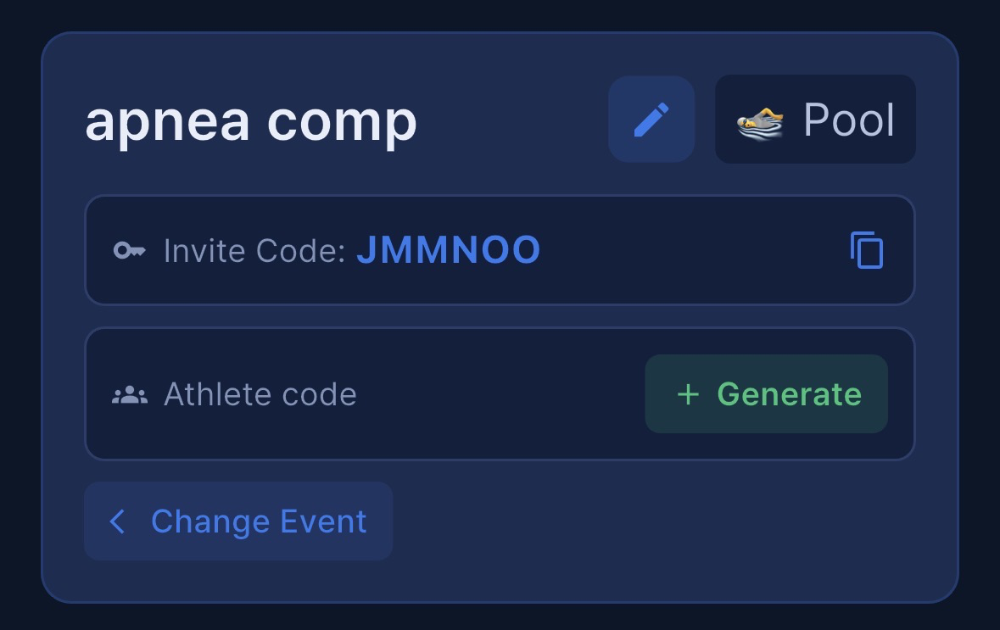
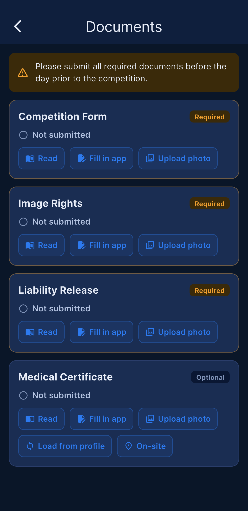
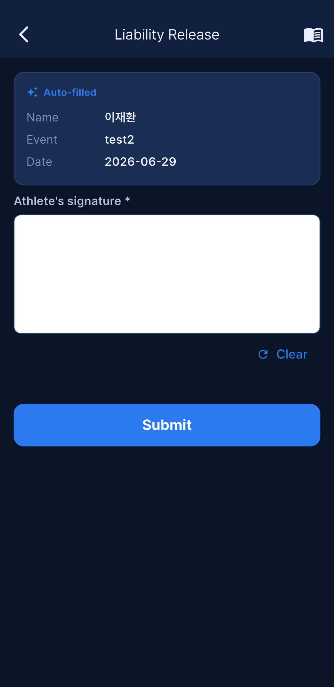
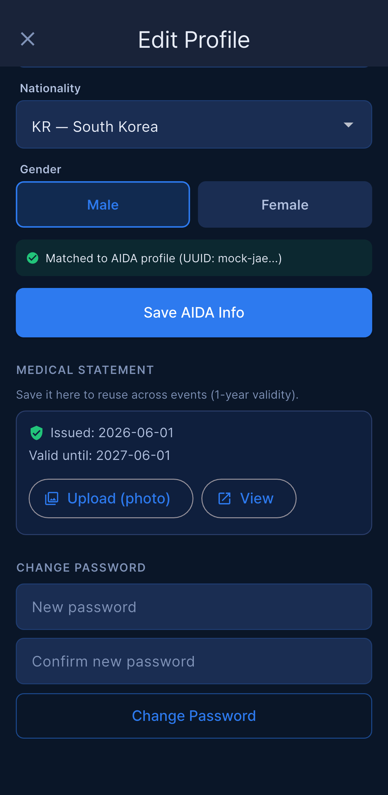
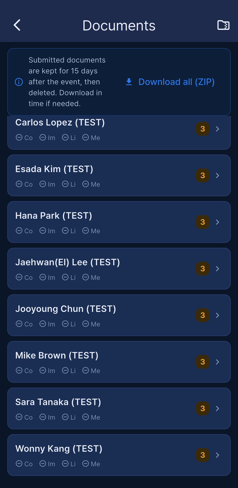
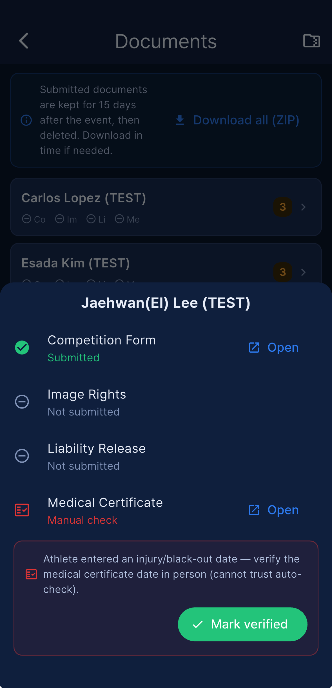

# Apnea Comp — ユーザーマニュアル

**AIDA Competition Management System**

このマニュアルは、Apnea Comp を使ったフリーダイビング大会の運営を、セットアップから結果発表まで網羅します。アプリ内の Help（More → Help）はクイックリファレンスですが、この文書は運営シナリオやトラブルシューティングを含め、より踏み込んで解説します。

5分しか時間がない場合は、下記の **クイックスタート** と末尾の FAQ をお読みください。

---

## 目次

1. [始める前に](#始める前に)
2. [クイックスタート](#クイックスタート)
3. [役割と各役割でできること](#役割と各役割でできること)
4. [イベントの作成（Organizer）](#イベントの作成organizer)
5. [イベントへの参加（Staff）](#イベントへの参加staff)
6. [選手として参加する](#選手として参加する)
7. [Setup: 選手、Line、OT](#setup-選手lineot)
8. [Break Times](#break-times)
9. [チーム戦（Team）](#チーム戦team)
10. [Check-in](#check-in)
11. [Start List & Speaker Mode](#start-list--speaker-mode)
12. [判定結果の入力](#判定結果の入力)
13. [ペナルティ（Rulebook 17.8）](#ペナルティrulebook-178)
14. [Protests（異議申し立て）](#protests異議申し立て)
15. [Re-swim & Opener](#re-swim--opener)
16. [スケジュール調整（OT Delay）](#スケジュール調整ot-delay)
17. [プッシュ通知](#プッシュ通知)
18. [オフライン動作](#オフライン動作)
19. [AIDA 連携](#aida-連携)
20. [複数日イベント](#複数日イベント)
21. [結果とエクスポート](#結果とエクスポート)
22. [表示 & 言語](#表示--言語)
23. [FAQ](#faq)
24. [トラブルシューティング](#トラブルシューティング)
25. [プライバシーとデータ](#プライバシーとデータ)
26. [連絡先](#連絡先)

---

## 始める前に

以下が必要です。

- Apnea Comp アプリをインストールした iPhone または Android デバイス。
- 安定したインターネット接続（大会当日は任意 — [オフライン動作](#オフライン動作) を参照）。
- 大会が公式採点される場合は AIDA International のアカウント（Organizer のみ）。
- Organizer 向け: 大会の AIDA Token と Event ID。これらがない場合、アプリは 🧪 Mock mode で動作します（サンプルデータ、AIDA 同期なし）。

各審判 / スタッフは各自のデバイスを使用することをおすすめします。アプリは同じイベントで複数人が同時に作業することをサポートしており、結果はデバイス間でリアルタイムに同期されます。

---

## クイックスタート

### Organizer（イベント作成者）向け

1. アプリを開き、Events 画面で **+** をタップします。
2. イベント名、種類（Pool / Depth / Team）、日程を入力し、Create をタップします。
3. イベントを開く → **Edit Event** → **AIDA Token** と **AIDA Event ID** を貼り付け → **Test Connection** をタップ → Save。
4. Setup タブ → **Load Athletes** で AIDA からスタートリストを取得します。
5. Setup タブ → **Lines**（レーン数）、**First OT**、選手間の **Interval** を設定します。
6. （Edit Event に表示される）イベントの **invite code** をスタッフと共有します。
7. スタッフが参加したら **Users** タブで承認します（Pending として表示されます）。

### Staff（審判、Check-in 担当者など）向け

1. アプリを開いてサインインします。  
   *ヒント: **Remember email** にチェックを入れると、次回からメールアドレスが自動入力されます。**Remember password** にチェックを入れることもでき、その場合パスワードはデバイスのセキュアなキーストア（iOS Keychain / Android EncryptedSharedPreferences）に保管され、当社のサーバーには保存されません。サインアウトすると両方とも消去されます。*
2. Events 画面 → **Join with code** をタップ → invite code を貼り付けます。
3. Organizer が承認して役割（Judge、Main Judge、Staff など）を割り当てるまで、Pending として表示されます。

### Athlete 向け

1. アプリを開き、メールアドレスでサインアップします。
2. サインアップ時に **I am an athlete** を選択します。
3. アプリが自動的にあなたの名前を AIDA のスタートリストと照合しようとします。
4. 一致すると、登録済みのイベントがすぐに表示されます。同名の選手がいる場合は、Organizer に一度限りの invite code を依頼してください。

これで当日の運営準備が整いました。

---

## 役割と各役割でできること

| 役割 | Setup | Judge | Check-in | Users | Log | OT Delay | Send Push |
|------|-------|-------|----------|-------|-----|----------|-----------|
| 👑 Organizer | ✅ | ✅ | ✅ | ✅ | ✅ | ✅ | ✅ |
| ⚖️ Main Judge | ✅ | ✅ | ✅ | ✅ | ✅ | ✅ | ✅ |
| ✏️ Judge | — | ✅ | ✅ | — | — | — | — |
| 👀 Staff | — | 閲覧 | ✅ | — | — | — | — |
| 🏊 Athlete | — | — | — | — | — | — | — |
| ⏳ Pending | — | — | — | — | — | — | — |

- **Organizer** はイベントを作成した人に付与される既定の役割です。
- **Main Judge** は Organizer と同じ権限を持ちます。Users で割り当てます。
- **Athlete** は読み取り専用です — スタートリストと個人の結果のみ。他のメンバーのデータ、AIDA token、操作機能にはアクセスできません。
- **Pending** メンバーは、Organizer または Main Judge が Users で承認し、実際の役割を割り当てるまで待機します。

---

## イベントの作成（Organizer）

### 基本情報

- **Name** — スタッフに表示されます。
- **Type** — 🏊 Pool、🌊 Depth、または 👥 Team。
- **Dates** — 複数日イベントの場合は開始日と終了日を選びます。

### AIDA 連携（推奨）

イベントを開く → **Edit Event** → 入力します。

- **AIDA Token** — AIDA 管理者パネルから取得します。
- **AIDA Event ID** — AIDA 大会の数値 ID。

**Test Connection** をタップします。緑のチェックマークは、認証情報が有効でアプリがスタートリストを読み取れることを意味します。Save。

> 

これらを空欄のままにするか、token を `test` または `demo` に設定すると、アプリは 🧪 **Mock mode** で動作します — 練習用のサンプル選手を生成します。Mock mode は AIDA に何も送信しません。

### スタッフを招待する

invite code は **Edit Event** に表示されます。普段使うチャネル（チャット、メール、紙）で共有してください。スタッフは Events 画面の **Join with code** でコードを入力します。

> ヒント: invite code のローテーションはまだサポートされていません。パスワードのように扱い、チームに加わるべき人だけと共有してください。

---

## イベントへの参加（Staff）

1. アプリにサインインします。
2. Events 画面で **Join with code** をタップします。
3. コードを貼り付けます。イベントが **Pending** ステータスでリストに表示されます。
4. Organizer の承認と役割割り当てを待ちます。承認されるとイベントがタップできるようになります。

誤って間違ったコードを使った場合は、Organizer に Users から自分を削除してもらい、再試行してください。

---

## 選手として参加する

イベントを運営するのではなく出場する場合は、選手としてサインアップすると、自分のスタートリスト、OT、Line、個人結果を確認できます。

スタッフ表示と選手表示はいつでも切り替えられます。アバター（右上）をタップ → **Switch to Athlete Mode**（戻すときも同じ方法）。

### 仕組み

サインアップすると、アプリがあなたの名前を読み取り、organizer が AIDA からすでにアプリに読み込んでいる選手との照合を試みます。ちょうど 1 件一致した場合、アカウントは自動的にリンクされます。それ以外の場合は、organizer が一度限りの invite code を発行できます。

### Path A — 自動照合（ほとんどの場合）

1. メールアドレスでサインアップします。
2. **I am an athlete** を選択します。
3. **first name**、**last name**、**gender**、**nationality** を、AIDA に登録されているとおり正確に入力します。
4. アプリが読み込み済みのイベントを検索します。名前が 1 名の選手と一致し、gender / nationality も一致すれば、すぐにリンクされます。
5. Events 画面に、あなたが含まれるイベントが表示されます。タップすると、スタートリストと（後で）結果を確認できます。

### Path B — invite code（名前が重複する場合）

2 名の選手が同じ名前の場合、自動照合ではどちらがあなたか判断できません。Organizer に invite code を依頼してください。

1. Organizer がイベントを開く → **Athlete Invite Codes** → リストであなたの名前を見つける → タップして 6 文字のコードを生成します。
2. Organizer がコードを個別に送ります。
3. あなたはアプリを開く → Events → **Enter invite code** → 貼り付けます。
4. アプリがコードを検証し、アカウントをリンクします。

### broadcast（参加用）コード — 最も手早く参加する方法

Organizer は、どの選手でもイベントに直接参加できる単一の **broadcast コード**（**Athlete code** として表示）を有効にできます — まだ AIDA の start list がない場合や、start list に載っていない選手の参加に便利です。

**Organizer:** イベントを開く → **Setup** → *Athlete code* の隣にある緑の **+** をタップして生成し、**コピー**して共有します（チャット、紙、プロジェクター）。電源アイコンをタップすれば、いつでもオフにできます。

**Athlete:** アプリを開く → Events → **Enter code** → broadcast コードを貼り付けます。参加すると、start list と結果を確認でき、書類を提出できます。

> 

### Find me on AIDA

> 

自動照合であなたが見つからない場合は、AIDA の選手プロフィールを手動でリンクできます。**Edit Profile** または **Athlete Setup** で **Find me on AIDA** をタップし、名前を入力して、結果から自分のプロフィールを選びます。これにより AIDA athlete ID が保存され、結果が正しく照合されます。🔄 sync アイコンは、あなたが登録されているイベントも取り込みます。（大会履歴のない選手は検索に表示されない場合があります — その場合は、名前、nationality、gender を AIDA に登録されているとおり正確に手動入力してください。）

### 見られる情報

Athlete Mode には 4 つのタブがあります。**My Info**、**Start List**、**Results**、**Rewards**（過去のイベントでは 3 つ — Start List なし）。

- 🏊 Athlete の役割: あなたが含まれるイベントへの読み取り専用アクセス。
- **My Info** — 割り当てられた OT、line、check-in ステータス（Pending / Checked-in / DNS / Late）、自分の結果。ここから protest を提出することもできます（[Protests](#protests異議申し立て) を参照）。
- **Start List** — その日の進行順。「Show my line only」フィルター付き。
- **Results** — 公開された結果。
- **Rewards** — discipline と gender ごとのポイント順位。自分の行がハイライトされます。

他の選手の個人情報、審判のメモ、AIDA token は見られません。

### プッシュ通知

通知を許可すると、以下を受け取ります。

- **Start list published** — Organizer がその日のスタートリストを公開したとき。
- **Unofficial / Official results** — 結果が公開されたとき。
- **OT delay** — スケジュールがずれて自分の OT が変わるとき。
- **Check-in 締め切りリマインダー** — 自動、まだ check-in していない場合のみ:
  - check-in 締め切り（OT − 1h）の 1 時間前
  - check-in 締め切りの 30 分前
- **Protest 更新** — 自分に関する protest が代理で提出された（署名を求める）とき、または jury が決定したとき。

通知テキストは選択したアプリ言語で届きます。通知は、デバイスのシステム設定またはアプリの About 画面でいつでもオフにできます。

---

## Documents (同意書)

多くの大会では、出場前に選手がAIDAの同意書を提出する必要があります。**My Info → Documents**を開きます。

- **必須フォーム** — Competition Entry、Image Rights同意書、Liability免責同意書。**Medical Statement**は任意ですが、求められることが多いです。
- **提出方法は2通り** — *アプリで記入*（項目を入力して画面上で署名すると、PDFが自動生成されます）または、署名済みの紙のコピーの*写真をアップロード*。
- **Medical Statement** — 発行日から1年間有効です。プロフィールに保存（Edit Profile → Medical Statement）すれば、複数の大会で再利用できます。写真をアップロードする場合は、証明書に記載された発行日を入力してください。発行日*以降*に圧迫障害やブラックアウトが発生した場合、証明書は無効になります。新しいものを提出してください。
- **締め切り** — 大会前日までに必須フォームが未提出の場合、不足している項目を知らせるプッシュ通知が届きます。

**スタッフ向け (Organizer / Main Judge):** **More → Documents**を開くと、各選手の提出状況を確認し、ファイルを開き、**すべてをZIPでダウンロード**できます（文書タイプごとのフォルダ）。選手が負傷やブラックアウトを申告すると、そのmedical statementは**手動確認**用にフラグが立てられます。証明書を直接確認したうえで*Mark verified*をタップしてください。提出された文書は大会終了後15日間保管され、その後削除されます。

---

## Setup: 選手、Line、OT

> 

Setup は、その日のスケジュールを決める場所です。どの選手がどの line で泳ぐか、OT（official time）はいつか、当日どんな休憩を入れるか。

**自動保存** — Setup で行ったすべての変更は自動的にサーバーに保存されます。アプリを離れて戻っても、設定は復元されます。共同運営者が AIDA から選手を再読み込みしても、スケジュールはあなたの line 構成を尊重します。

### 選手の読み込み

- **Load Athletes** — AIDA から登録済みのスタートリストを取得します。冪等です: 再読み込みしても既存の判定は保持されます。
- **Mock mode** — 練習用のサンプルスタートリストを生成します。

### Line と OT の設定（基本）

- **Lines** — レーン数（Pool）またはプラットフォーム line 数（Depth）。
- **First OT** — 最初の選手がスタートする時刻（例: `09:00`）。
- **Interval** — 同じ line 上で連続する選手間の間隔。
- **Depth Line Interval**（Depth / Team のみ） — **ON** のとき、line は順次進行します: 各 line はずらしたオフセットで開始し（Line 1、その数分後に Line 2 …）、Start List には line ごとのカウントダウンが表示されます。オフセットは `(lines − 1) × line_interval < athlete_interval` を満たす必要があり、そうでないとスケジュールを生成できません。**OFF** のときは、すべての line が **並列** で進行し、同じ行の選手が同じ OT を共有します — Pool モードとまったく同じです。

### Advanced Setup（任意、開閉可能）

> 
> 

**Advanced Setup** をタップすると、きめ細かい制御のためのオプションが展開されます。

- **discipline ごとの line（Pool のみ）** — discipline ごとに異なるレーン数を割り当てます。例えば、STA は 4 レーン使用ですが、DYN/DNF は 2 レーンのみ使用します。アプリは discipline ごとに別々のサブスケジュールを生成し、つなぎ合わせます。
- **discipline 間のレーン引き継ぎ** — 前の discipline が line の途中で終わったとき（例: STA が 4 レーン中レーン 3 で終了）、次の discipline はレーン 1 から再開する（既定）か、レーン 4 から続行するかを選べます。審判が discipline をまたいで同じレーンに留まる場合に便利です。

- **Custom Intervals（インターバル個別設定）** — 基本インターバルに加えて、スタート順番の範囲ごとに異なるインターバルを設定します。例：#1–#10 → 10分、#11–#20 → 8分、#21–#30 → 7分。**Add interval（インターバルを追加）** をタップ → *開始順番 / 終了順番 / インターバル* を設定 → **Done**。OT は自動的に再計算・保存されます。日ごとの設定で、範囲は重複せず選手数以内である必要があります。範囲がなければ全員に基本インターバルを適用。その日に手動の休憩がある場合、OT の再計算はスキップされます（Save Configuration と同じ — 手動調整した OT を保護）。

### Line の割り当て

選手を読み込んだ後、**Assign Lines** を開いて line 間で移動したり並べ替えたりします。OT は自動的に再計算されます。

- Pool: ラウンドロビン割り当て。OT は line 内での位置に依存します。
- Depth: line サイクリングを伴う完全なシーケンス。depth line interval のルールを考慮します。

**Line の直接割り当て** — 特別なケース（例: 国内記録挑戦用に特定の line を予約、または re-swim の配置 — [Re-swim & Opener](#re-swim--opener) を参照）では、選手をタップしてから、対象の line と位置をタップします。スケジュールはあなたの選択を尊重して再構成されます。

完了したら Save — これでその日のスタート時刻が確定します。

---

## Break Times

休憩は、一定の時間枠だけスケジュールを一時停止します。アプリは 2 種類の休憩をサポートします。

### Time-based 休憩（Lunch Break など）

> 

全員が事前に合意する固定時刻の休憩（昼食、式典など）に使います。

1. Setup → **BREAK TIMES** → **Add Break Time** を開きます。
2. **Time-based** を選びます。
3. 開始時刻と終了時刻を入力します（例: `12:00` – `13:00`）。
4. 保存します。

休憩枠の中に OT が含まれる選手は、OT が休憩終了後になるように後ろにずらされます。レーン割り当ては保持されます。

### After Athlete 休憩（Build 48 で新規）

> 
> 

時計の時刻に関係なく、**特定の選手が終わった後** に休憩を挿入する必要があるときに使います。典型的なシナリオ: ウォームアップの選手が終わり、公式選手が始まる前に 60 分の休憩を入れたい場合です。

1. Setup → **BREAK TIMES** → **Add Break Time** を開きます。
2. **After Athlete** を選びます。
3. 区切りとなる選手（この選手まで終わったら休憩開始）を選びます。
4. 休憩時間（例: `60` 分）を入力します。
5. 保存します。

選択した選手と、**スタートリスト順でそれより後のすべての選手** が休憩時間分ずらされます。他の discipline（順序が前で、時計の時刻が同じだけの選手）は影響を受けません。レーン割り当ては保持されます。

休憩を削除するには、BREAK TIMES リストでその隣の 🗑️ ゴミ箱アイコンをタップします。

---

## チーム戦（Team）

Team 種類のイベント（イベント種類 **Team**）は、選手をチームにまとめ、その合計スコアで順位を決めます。**Setup** に **Teams** セクションが表示されます — Team 種類のイベントのみです。

> 

### チームの作成と編集

**New Team** をタップすると、チームエディターが開きます。

> 

- **名前** — 必須。
- **色** — リストでチームを見分けやすいように色を選びます。
- **メンバー** — チームに属する選手にチェックを入れます。リストは名前または nationality で検索できます。すでに別のチームにいる選手を選ぶと、そのチームへ移動します。

各チームカードには、名前、色、メンバー数が表示されます。カードをタップして **編集** するか、メニューから **削除** します。

> 複数日にわたって出場する選手は一度だけ表示されます — その選手を選ぶと、その選手の **すべての日のエントリー** がチームに割り当てられるので、各人を一度だけ選べば済みます。

---

## Check-in

選手はウォームアップの前にサインインします。**Check-in** タブを開きます。

- pending ステータスの選手カードをタップすると、署名シートが開きます。
- 選手が画面上で署名し、**Save** をタップ → 現在時刻で Checked In として記録されます。その後カードには OT と check-in 時刻の両方が表示されます。
- 欠席者の場合: 選手をタップ → **DNS**（Did Not Show）を確認します。
- 締め切りを過ぎた遅刻者の場合: タップ → **Late Check-in**。自動的に「Late Check-in」の remark 付きで Red カードが付きます。
- **自動 Late Check-in** — check-in 締め切り（OT − 1h）を過ぎても pending のままの選手は、自動的に **Late Check-in** として記録されます。pending リストには各選手の締め切りが `Check-in HH:mm` として表示されます。
- **AIDA 同期** — DNS と Late Check-in は、判定結果と同様に AIDA に自動送信されます（Red カード / 0 点として）。Judge で手入力する必要はもうありません。
- 上部のミニカード（In / Late / DNS / Pending）をタップすると、そのグループだけにリストをフィルターできます。

> 署名の描画は視覚的な確認のためだけのものです — check-in の瞬間にスタッフのメンバーに表示され、シートが閉じるとすぐに破棄されます。署名の画像はどこにも保存しません（サーバーにもデバイスにも）。署名が取得されたという事実と、check-in 時刻だけが記録されます。

> Check-in はオフラインでも動作します。確定したときにデバイスがオフラインの場合、check-in はデバイスのメモリに保持され、カードに小さな ⛔「Offline」バッジが付き、再接続から 5 秒以内に自動的にサーバーと同期されます。[オフライン動作](#オフライン動作) を参照してください。

---

## Start List & Speaker Mode

> 

Start List タブは、その日の進行順と、次の選手の OT までのライブカウントダウンを表示します。各 OT が近づくと、アプリがカウントダウンを声で読み上げるので、選手や審判は画面を見なくても聞き取れます。

### 音声カウントダウン

各 OT が近づくと、アプリが音声の合図を再生するので、選手や審判は画面を見なくてもカウントを聞き取れます。合図は **事前録音された音声ファイル** なので、**iOS と Android で同一に** 聞こえます（以前のバージョンは各スマホの内蔵 text-to-speech を使っていたため、デバイスごとに異なっていました）。

OT 前の合図:
`2:00`（「two minutes to official top」）、`1:30`、`1:00`、`0:30`、`0:20`、`0:10`、続いて `5 — 4 — 3 — 2 — 1`、そして OT で **「official top」**。

スタートウィンドウ中（OT 後）の合図: +1 秒で **「plus one」**、その後ウィンドウが終わるまで経過秒数が読み上げられ（discipline の上限まで）、ウィンドウ終了までに選手がスタートしなければ **「start cancelled」** で終わります。

### 音声アナウンス（Voice Announce）

自動のカウントダウン合図とは別に、Start List には任意のタイミングで一度だけ読み上げる手動の **Announce** ボタンがあります。次の OT まで何分かを、自分の合図で知らせたいときに便利です。

1. Start List の **Announce**（音声アナウンス）ボタンをタップします。
2. 「OT の何分前か」を分単位で入力します。
3. デバイスの text-to-speech が **「N minutes to Official Top」** を読み上げます。

自動のカウントダウン合図（上記の音声カウントダウン）が事前録音の音声ファイルを使うのに対し、この手動アナウンスは **デバイスの text-to-speech** を使い、デバイスの言語（en / ko / ja / zh / zh_TW）に従って読み上げられます。1 回限りの手動の合図であり、自動カウントダウンとは独立しています。

### ミュートボタン

> 

AppBar の 🔊 / 🔇 アイコンをタップすると、音声アナウンスを切り替えられます。次の場合に便利です。

- すでに別の PA システムがアナウンスしている屋内プールで運営している。
- 選手が無音のカウントダウンを好む。
- 会議に入って、デバイスを静かにする必要がある。

ミュートは切り替えたデバイスにのみ適用されます — 同じイベントの他のデバイスは音声を出し続けます。視覚的なカウントダウンは関係なく動き続けます。

### Speaker Mode

> 

Speaker Mode はデバイスを **専用のカウントダウンアナウンサー** に変えます — 会場のメインスピーカーに最適です。有効にすると:

- 画面が Start List ビューにロックされ、他のタブは非表示になります。
- ミュートは強制的にオフになります（誤ってミュートできません）。
- 画面は常時点灯したままになります（自動ロックなし）。
- Speaker Mode を終了するには PIN が必要なので、好奇心旺盛な通りすがりの人が誤って閉じることはありません。

**有効にするには**: 役割 / プロフィールメニューを開く → **Speaker Mode** → 4 桁の PIN を設定します。

**終了するには**: Speaker Mode のバッジをタップ → PIN を入力 → 確認します。

推奨セットアップ: 会場の音響システムに接続した専用のスマホまたはタブレットを、大会当日ずっと Speaker Mode にしておきます。充電器につないだままにしてください — 音声再生は、何もしない待機状態よりもバッテリーを早く消耗します。

**バックグラウンド音声（Speaker Mode 限定）** — Speaker Mode 中は、音声（カウントダウン合図と手動アナウンスの両方）が、アプリをバックグラウンドに送ったり画面をロックしたりしても再生され続けます。iOS は無音の keep-alive トラックを再生し続け、Android はフォアグラウンドサービスの通知（「Start list countdown active」）を使います。これにより、スマホがロックされていても会場のスピーカーがアナウンスを流し続けます。この挙動は Speaker Mode 限定です。

### 画面の常時点灯

アプリは Start List だけでなく **すべて** の画面で画面を点灯したままに保つので、デバイスに触れなくてもカウントダウンや通知が機能します。これはグローバル設定です — アプリを開くとすぐに適用されます。注意: 終日のイベントではデバイスを充電器につないだままにしてください。バッテリーが通常より早く消耗します。

---

## 判定結果の入力

> 

Judge タブは当日のすべての選手を表示します。カードをタップして結果を入力します。

### 結果の入力

1. **RP** — 実現したパフォーマンス（static は時間、dynamic は距離、depth は深度）。
2. **カード** — White（クリーン）、Yellow（ペナルティ）、または Red（DQ）。
3. **ペナルティ理由** — White 以外のカードを選んだときに必須。[ペナルティ](#ペナルティrulebook-178) を参照。
4. **Start offset** — 早い（マイナス）または遅い（プラス）秒数。スタートウィンドウのペナルティ計算に使われます。
5. **REMARKS** — 特定の理由（BO、Other Penalty、DQ Other など）に必須。アプリがテンプレートを事前入力するので、足りない詳細を補ってください。
6. **Save Result** をタップします。

### カードバッジ

保存すると、選手カードに小さなバッジが表示されます。

- **✅ AIDA** — AIDA International に同期済み。
- **🔁 Retry** — AIDA への同期に失敗。タップすると理由を確認して再試行できます。
- **⛔ Offline** — このデバイスにローカル保存済み。オンラインに戻ると自動的に同期されます。[オフライン動作](#オフライン動作) を参照。

バッジが表示されない場合、AIDA 連携が設定されていません（その選手に startId がありません） — Mock mode では正常です。

---

## Judge Calculator（RP の計算）

RP を手で計算する代わりに、アプリには Judge 画面の選手詳細シートから開く計算ツールが組み込まれています。完走した lap 数や 2 名の審判の計測時間を入力すると、RP が自動で求まります。

### Pool Length（m）

距離計算（Distance Calc）を使うには、まずイベントの Setup で **Pool Length（m）** を設定します。これは **Pool / Team** 種類のイベントのみで利用でき、Depth は対象外です。Pool Length は Distance Calc に必須です。

### Distance Calc（DYN / DYNB / DNF）

Judge 画面 → 選手詳細シート → 自（ruler）ボタンをタップします。

1. 完走した lap 数を入力します。
2. 最後の不完全な lap の部分距離（m）を入力します。
3. 結果 = lap 数 × Pool Length + 部分距離 として計算されます。
4. **Fill RP** をタップすると、その距離が RP に自動入力されます。

### STA Average Calc（STA）

Judge 画面 → 選手詳細シート → タイマーボタンをタップします。

1. 2 名の審判の計測時間を `mm:ss` で入力します。
2. 平均が計算されます（最も近い秒に丸められます）。
3. **Fill RP** をタップすると、その時間が RP に自動入力されます。

### 注意

- **RP < AP** のとき、White カードは自動的に無効になります（Under AP では White を選べません）。
- Depth 種目（CWT / CWTB / FIM / CNF）には計算ツールはありません — RP は手で入力します。

---

## ペナルティ（Rulebook 17.8）

アプリは AIDA Rulebook の 17.8 セクションに従います。理由はカードの色でグループ化されています。

### 🟨 Yellow カードの理由

- **Start** — 不正なスタート技術（Pool DYN: 壁スタートの失敗など）。
- **Early Start** — OT より前に出発。スタートウィンドウ内で、早い 5 秒ごとに 1 点。
- **Late Start** — OT より後に出発。スタートウィンドウ内で、遅い 5 秒ごとに 1 点。
- **Grab** — パフォーマンス中に line、壁、またはプラットフォームを掴んだ。
- **Other Penalty** — 上記でカバーされない、その他すべて。**REMARKS 必須**。

### 🟥 Red カードの理由

- **Surface Protocol** — 浮上から 15 秒以内の surface protocol が不正確。
- **Blackout Surface** — 水面で運動制御または意識を喪失。**REMARKS 必須**（回復時間など）。
- **Blackout UW** — 水中でのブラックアウト。**REMARKS 必須**。
- **DQ Late Start** — Late Start がスタートウィンドウを超過（Pool +10s、Depth +30s）。
- **Jump Start** *(Pool DYN のみ)* — OT より前に壁を離れた。
- **DQ Other** — その他の理由による失格。**REMARKS 必須**。

### スタートウィンドウ

| Discipline | ウィンドウ | ウィンドウ内 | ウィンドウ超過 |
|------------|--------|----------------|-------------|
| Pool | ±10 s | 5 秒ごとに 1 点（Yellow Early/Late Start） | 遅い側は DQ Late Start（Red）; 早い Pool の壁スタートは Jump Start（Red、DYN のみ） |
| Depth | ±30 s | 5 秒ごとに 1 点（Yellow Early/Late Start） | 遅い側は DQ Late Start（Red） |

### REMARKS

AIDA Rulebook 4.1.16.2 は、すべての Yellow と Red に書面の理由を要求します。理由に対して REMARKS が必須なのに空欄の場合、Save ボタンは動作をブロックします。

理由を選ぶと、REMARKS フィールドにテンプレートが事前入力されます（例: `BO Surface, recovery: ___`）。保存する前に足りない詳細を補ってください — これが公式記録です。

### 複数選択と複合カード

> 

Red カードをタップすると、理由シートに **Red と Yellow の両方** の理由が 2 つのグループで表示されます。

- **DQ Reason (Red)** — Surface Protocol、Blackout Surface、Blackout UW、Airways、DQ Late Start、Jump Start、Pull、Touch、Other Lane、Check-in DQ、DQ Other
- **Additional Penalty (Yellow)** — Under AP、No Tag、Grab、Pull、Turn、Start、Early Start、Late Start、Lanyard、Other Penalty

両方のグループにまたがって複数の理由を選び、一度に保存できます — 例えば Red **Airways** と Yellow **Under AP**。選択されたチップはカテゴリーごとに色分けされているので、何が記録されているか一目で分かります。

Yellow カード単独でも複数選択をサポートします（例: Early Start + Grab）。Yellow カードでは Red グループは表示されません。

---

## Protests（異議申し立て）

protest は、AIDA Rulebook 17.8 に基づいて結果に正式に異議を申し立てるものです。Apnea Comp は、申し立て、選手の署名、jury の決定、結果へのあらゆる変更まで、全フローを追跡します。

**すべての protest は選手の署名で終わります**。スタッフのメンバーが選手に代わって開始した場合でも同様です。

### 申し立てできる人

Organizer、Main Judge、Judge、または選手本人。手数料はアプリでは追跡しません。

### 選手として申し立てる

> 

1. Athlete Mode → **My Info** → 自分の結果の隣の **File Protest** をタップします。
2. 理由を入力し、画面上で署名して、提出します。

> 

protest のステータスが **Pending** になります — jury 待ちです。

### 代理で申し立てる（スタッフ）

1. **Judge** タブ → 選手カードをタップ → **File Protest (on behalf)**。
2. 理由を入力して提出します。まだ署名はありません。
3. protest は **Awaiting signature** として選手に送られます。選手は自分のスマホで **My Info** を開いて確認し、署名します — そのときに初めて **Pending** になります。

### Jury の決定

> 

**More → Protests**（Organizer / Main Judge / Judge）を開きます。リストは protest をステータスごとにグループ化します（Awaiting signature / Pending / Reviewing / Accepted / Rejected / Withdrawn）。1 つをタップして決定します。

> 

- **Accept** — 結果（card、RP、remarks）を修正できます。選手の記録が自動的に更新され、変更は Results、Rewards、AIDA に反映されます。
- **Reject** / **Withdraw** — 結果はそのままです。

protest が **Awaiting signature** のままでは決定できません — 選手が先に署名する必要があります。

### Jury の投票

最終決定は、jury による **匿名投票** で行えます。Judge と Main Judge が、それぞれ **Accept** または **Reject** に投票します。投票は匿名で、**誰がどう投じたか** は表示されず、各側の **集計数のみ** が表示されます。

賛否が **同数** の場合は、Main Judge が **deciding（キャスティング）投票** で決着させます。最終決定フォームには **Jury の署名が必須** です。

### protest の削除

Organizer または Main Judge は、詳細画面（🗑 ゴミ箱アイコン）からどの protest でも削除できます — テスト項目や、決して来ない署名を待って止まっている古い protest を整理するのに使ってください。

### 通知

protest が **申し立てられた**、**署名待ち**、または **決定された** とき、すべてのスタッフと該当する選手が、それぞれのアプリ言語でプッシュを受け取ります。

---

## Re-swim & Opener

### Re-swim

protest が認められたとき（または審判が再演技を求めたとき）、選手は再び泳ぎます。AIDA からその日のスタートリストを読み込むとその日の選手が置き換わるため、re-swim はまず **キューに予約** され、対象日のリストが作られるときに挿入されます — こうして再読み込みで消されることがありません。

> 

1. **予約** — Judge / Main Judge / Organizer。protest を決定する際に re-swim を承認するか、選んだ日に予約します（日付ドロップダウンから日付を選ぶ）。
2. **配置** — その日のスタートリストが作成または読み込まれると、アプリが *「N re-swim(s) to place.」* と促します。自動ソート（AP 昇順 / 降順 / ランダム）を選ぶか、**Assign Lines** で各選手を手動配置します（選手をタップしてから対象の line と位置をタップ）。re-swim がすでに読み込まれている日のものであれば、すぐに配置できます。そうでない場合は、Setup → Add Athlete の下に **「Place pending re-swims」** という安全ボタンがあります。

> 

3. **元のエントリーは除外** — 元のエントリーは **invalidated** として記録されます: 順位（Rewards）からは除外されますが、Results には引き続き表示されます。re-swim の結果がその日の順位に反映され、元の start ID を使って AIDA に送信されます。

### Opener

**opener** は、カウントしないウォームアップまたはデモのエントリーです。Organizer / Main Judge が **Setup → Add Athlete** で 1 つ追加します: 名前、nationality、gender、discipline、AP、PB（STA は mm:ss の時刻ピッカーを使い、他の discipline は数値を使います）。Opener は **順位から除外され、AIDA には決して送信されません**。

> 

---

## スケジュール調整（OT Delay）

当日がずれた場合（長いウォームアップ、事故、機材トラブルなど）、スタートリストを作り直さずに残りの OT をずらせます。

### どこにあるか

**Start List** または **Judge** タブの AppBar には、右側の役割バッジのすぐ前に 🕒 アイコンが表示されます。**Organizer と Main Judge にのみ表示されます。**

> 

### 使い方

1. 🕒 をタップ → **Adjust Schedule** ダイアログが開きます。
2. 遅延の起点となる選手を選びます（OT がずれる最初の選手）。
3. 遅延を **分** 単位で入力します（整数、プラスのみ）。
4. プレビューに、影響を受ける各選手の新しい時刻が表示されます — 旧 → 新。
5. **Apply** をタップします。

選んだ選手以降のすべての OT が、その分だけ前方にずれます。対応する check-in / ウォームアップの時刻も一緒にずれます。

### 副作用

- **プッシュ通知** — OT が変わったすべての選手に自動でプッシュが送られます: *「Your OT has been delayed by N minute(s)」*。何かを購読している必要はなく、通知は影響を受けた選手のみを対象にします。
- **アクティビティログ** — Log 画面に記録されます。

### 重要

- プラスの遅延のみサポートします。前倒しはできません。
- Undo は **まだ利用できません** — 適用する前にプレビューを慎重に確認してください。
- すべてのスタッフのデバイスがリアルタイムで更新されます。

---

## プッシュ通知

Apnea Comp は、時間に敏感なイベント更新にプッシュ通知を使います。通知は OneSignal を通じて配信され、OneSignal がそれを APNs（iOS）と Firebase Cloud Messaging（FCM、Android）に転送します。各通知は受信者が選択したアプリ言語で送信されます。

### 何が送られるか

2 種類あります: 手動でトリガーする通知と、イベントの状態に応じてシステムが自動で送る通知です。

#### 手動（Organizer / Main Judge のみ）

More メニューから **Send Push** を開くと、3 つのボタンのある小さなパネルが開きます。それぞれ、選んだ日に登録されたすべての選手に送られます。

- **Publish Start List** — その日のレーンと OT が確定したとき。
- **Unofficial Results** — 選手レビュー用に初期結果を公開する。
- **Official Results** — protest ウィンドウ後の最終結果。

各タップで、送信前に受信者数を示す確認ダイアログが表示されます。

#### 自動

これらはスタッフの操作なしで実行されます。

| トリガー | 受信者 | タイミング |
|---------|-----------|------|
| OT Delay 適用 | 影響を受けた選手のみ | Organizer / Main Judge が遅延を適用した直後 |
| Check-in 締め切りリマインダー（1 時間） | まだ check-in していない選手 | OT の 2 時間前（= check-in 締め切りの 1 時間前） |
| Check-in 締め切りリマインダー（30 分） | まだ check-in していない選手 | OT の 1.5 時間前（= check-in 締め切りの 30 分前） |
| Protest 申し立て | すべてのイベントスタッフ + 該当選手 | protest が提出されたとき |
| Protest 署名待ち | すべてのイベントスタッフ + 該当選手 | スタッフが選手に代わって申し立てたとき |
| Protest 決定 | すべてのイベントスタッフ + 該当選手 | jury が accept / reject / withdraw したとき |

選手が check-in する（または DNS / Late として記録される）と、リマインダーは止まります。

### 誰が通知を受け取るか

以下のすべてを満たすユーザーのみ:

- リンクされた選手アカウント（上記の Path A または Path B）
- OS レベルで通知が有効
- アプリ内で通知が有効（既定: オン）
- 有効なプッシュトークン（アプリを少なくとも一度起動すると作成されます）

### 通知の無効化

- iPhone: 設定 → Apnea Comp → 通知 → オフに切り替え。
- Android: 設定 → アプリ → Apnea Comp → 通知 → オフに切り替え。
- アプリ内: More → About → 通知トグル。

無効にすると、プッシュトークンがサーバーから直ちに消去されます。

---

## オフライン動作

アプリは、プール / depth の会場でよくある、日中にインターネットが切れる状況でも動作し続けるように設計されています。

### 接続が切れたときに起こること

上部に赤いバー **「You are offline」** が表示されます。それでも次のことはできます。

- ✅ Judge の結果を保存（ローカルに保存され、後で同期）
- ✅ 選手の Check-in（ローカルに保存され、後で同期）
- ❌ AIDA から新しい選手リストを読み込む
- ❌ プッシュ通知を受信する（再接続時に配信、FCM が保持）

### Offline バッジ

> 

オフラインで結果を保存すると、選手カードに AIDA 同期バッジの代わりに小さな **⛔ Offline** バッジが表示されます。これは次を意味します。

- 結果はデバイスのメモリに **安全** に保管されています。
- まだサーバーに **到達していません**。
- アプリがバックグラウンドで 5 秒ごとに自動再試行します。

インターネットが戻ると、バッジは自動的に **✅ AIDA** に変わります。手動操作は不要です。

### 手動同期

何らかの理由で自動再試行が追いついていない場合は、**Results** を開きます。

> 

保留中のものがあれば、オレンジ色のバナーが表示されます。

- **「N offline result(s) waiting to sync」** と **Sync now** ボタン — タップするとすぐに再試行します。
- **「M results not synced to AIDA」** と **Resync** ボタン — AIDA 側の失敗（token、サーバーエラーなど）向け。

### ⚠️ 重要

オフライン結果は、同期されるまでデバイスのメモリに存在します。**オフラインの項目が保留中の間は、アプリを強制終了したりスマホを再起動したりしないでください** — 失われてしまいます。⛔ バッジがすべて消えるまで待つか、終了する前に Sync now をタップしてください。

不安な場合は、Results を開いてオレンジのバナーを確認してください。バナーなし = 保留中のものなし。

---

## AIDA 連携

### token を取得する

<https://www.aidainternational.org> で AIDA International の管理者アカウントにログインします。登録した大会を開きます。API / Integration セクションを探して、次をコピーします。

- **AIDA Token** — 長い英数字の文字列のように見えます。
- **AIDA Event ID** — 数字で、通常は 4〜6 桁です。

これらのオプションが見つからない場合は、大会を登録した AIDA 管理者が共有する必要があるか、アカウントの権限を更新する必要があります。

### アプリで設定する

Edit Event → 両方の値を貼り付け → Test Connection → Save。アプリは token をサーバーに安全にキャッシュします（URL に決して露出しません）。token を更新すると、新しい値は次回の保存からすぐに使われます（アプリの再起動は不要）。

### 何がいつ同期されるか

- **読み取り** — Setup → Load Athletes が、名前、AP、PB、discipline を含むスタートリストを取得します。
- **書き込み** — Judge での Save ごとに結果（RP、card、reasons、remarks、start offset）を送信します。バックグラウンドで、ブロックしません。

### 同期が失敗したとき

- **token 期限切れ / 無効** → 赤い SnackBar: *「AIDA token invalid — update in Edit Event」*（Organizer / Main Judge）または *「ask Organizer to update」*（その他）。token を更新してから Results → Resync。
- **ネットワークエラー** → カードに 🔁 Retry バッジ。タップするとエラーメッセージが表示され再試行できます。または Results → Resync で一括処理します。
- **オフライン** → ⛔ Offline バッジ。オンライン時に自動再試行します。[オフライン動作](#オフライン動作) を参照。

### Mock mode

token を `test` または `demo` に設定する（または両方のフィールドを空欄にする）と、AIDA なしで動作します。アプリがサンプル選手を生成し、何も送信されません。トレーニング、ドライラン、アプリのデモに使ってください。Mock モードのイベントは実世界の日付を無視するので、カウントダウンと音声プロンプトがすぐに動作してテストに使えます。

---

## 複数日イベント

複数日にまたがる大会の場合:

- Setup → **Total Days** → 大会日数を設定します。
- 各日が独自のスタートリスト、check-in、結果、OT を持ちます。
- 2 日以上ある場合、AppBar の下に **Day selector** が表示されます。タップして切り替えます。
- **Rest days**: Setup で指定します。スケジューリングではスキップされます。

データは日をまたいで **持ち越されません** — Day 2 で選手を移動しても Day 1 には影響しません。日をまたいだ合計スコアは Results で計算されます。

イベントが AIDA に複数日として登録されている場合、Load Athletes が日ごとのスタートリストを自動的に取得します。

---

## 結果とエクスポート

**Results** タブは、判定が入るにつれて更新されるライブ順位を表示します。

- 上部の **サマリーカード**: 合計選手数、white / yellow / red、AP / PB / RP。
- イベントで絞り込む **discipline フィルター**。
- 上部の **同期バナー**（ある場合）: Offline 保留、AIDA 保留、または token の問題。
- ポイント順にソートされた **選手リスト**、タップで詳細。
- **Export** — 掲示板への掲示や選手への送付用に CSV を共有します。

### Rewards & ランキング

**Rewards** タブ（Athlete Mode のタブでもあります）は、選手をポイントで順位付けし、discipline と gender ごとにグループ化します。

- **Day チップ** — Total、Day 1、Day 2 … で順位の範囲を絞ります。
- **Include yellow card scores** トグル。
- **Tiebreak**（右上 ⚙） — ドラッグして tiebreak のルールを並べ替えます。AIDA の既定（Rulebook §4.2.16）は: total points → **AP−RP 差が最小** → Red が少ない順 → Yellow が少ない順 → White が多い順。完全に同点の選手は同じ順位を共有し、次の順位は飛ばされます（**オリンピック方式**、例：1位が2人 → 次は3位）。深度の RP は整数メートルで入力します（§4.1.22.1）。
- Opener と invalidated（re-swim された）エントリーは順位から除外されます。全員が引き続き Results に表示されます。
- **Export CSV** — ↓ アイコンが UTF-8 CSV を共有します（すべての言語で Excel / Numbers で正しく開きます）。現在の Day / Yellow / Tiebreak の設定を反映します。

---

### Records (WR/CR/NR) — 記録

世界 / 大陸 / 国の記録挑戦を表示・確定します。

1. **大会を表示** — 大会の作成・編集時に **Record Attempts** で **World Record** / **Continental** を有効にします。すると大会カードと Results の上部に 🏅 バッジが表示されます。
2. **記録を確認** — **Results** タブで **Check WR/CR/NR** をタップします。white card の選手ごとに AIDA 公式記録（国籍・種目・性別）を照会し、WR / CR / NR を提案します。ネットワークが必要 — 取得できないものはスキップされます。
3. **確定** *(Organizer / Main Judge)* — 提案は破線のバッジ（例：「WR?」）で表示されます。タップしてレベルを確定または解除します。確定した記録は実線のバッジで表示され、CSV エクスポートに含まれます。

> white card（有効）の記録のみが対象です。ペナルティのある記録は世界・大陸記録にはなりません（Rulebook §10.2）。提案は実現記録（RP）を現在の記録と比較したもので、最終判断は審判が行います。

## 表示 & 言語

どちらの設定もアバターメニュー（右上）にあり、アプリ全体に即座に適用されます。

### Theme

> 

アバターをタップ → **Theme** → **System default**、**Light**、または **Dark** を選びます。

### Language

> 

アバターをタップ → **Language** → **System default**、**English**、**한국어**、**日本語**、**简体中文**、または **繁體中文** を選びます。アプリはすぐに切り替わり、選択を記憶します。

大会標準の用語はどの言語でも英語のままです — OT、AP、RP、PB、discipline コード（STA、DYN、…）、WHITE / YELLOW / RED、役割名、Line — そのため、異なる国のスタッフが同じラベルを読めます。

---

## FAQ

### スタッフのスマホのバッテリーが切れたら、その人の入力は失われますか?

いいえ。結果を保存した瞬間に、サーバー（オフラインの場合はそのデバイス）に保存されます。同じイベントの他のデバイスはすぐに結果を見られます。たとえそのスマホが永久に失われても、リスクにさらされるのは未同期のオフライン結果のみで、しかも障害の瞬間に保留中のものがあった場合に限られます。

### 2 人が同じ選手を見ていて、異なる結果を保存しています

最後の保存が優先されます。アプリは現在、同時編集について警告しません。これを避けるために口頭で調整してください — 通常、特定の結果を入力する審判は 1 人だけです。

### 選手に AP / PB は表示されるのに startId がありません — なぜですか?

おそらく Mock mode で追加されたか、AIDA の外で手動でインポートされたものです。AIDA 同期には startId が必要です。それらの選手の結果は AIDA に送信されません（バッジは表示されません）。Results には引き続き表示されます。

### AIDA token を変更しましたが、古い結果がまだ失敗します

Results を開く → バナーに「Update token & resync」と表示されたら → タップします。保留中の項目が新しい token で再送信されます。アプリは認証情報をサーバーにキャッシュし、Edit Event を保存するとキャッシュを更新するので、アプリの再起動は不要です。

### check-in 中にインターネットが切れたらどうなりますか?

check-in はローカルに保存され、選手カードに小さな ⛔「Offline」バッジが表示されます。接続が戻るとすぐに、check-in は自動的に（5 秒以内に）サーバーと同期されます。選手が再度署名する必要はありません。署名の描画自体は保存されません — その瞬間の視覚的確認にのみ使われます。

### 選手がプッシュ通知を受け取りません

よくある原因:

- 選手はサインアップしていますが、まだ AIDA の選手レコードにリンクされていません（自動照合が見つからず、invite code も使われていない）。リンクがないと、システムはどの選手がその人なのか分かりません。
- OS レベルで通知が無効になっています。iPhone: 設定 → Apnea Comp → 通知。Android: 設定 → アプリ → Apnea Comp → 通知。
- 新しいデバイスでアプリがまだ起動されていません — プッシュトークンは起動時に発行されます。
- 選手が DNS / Late / すでに check-in 済みとして記録されています（この場合、check-in リマインダーは意図的に止まります）。

### イベントを削除できますか?

はい。Organizer または Main Judge はイベントを削除できます — イベントリストでスワイプするか、**Edit Event → Delete** を使います。削除は永久的で、そのイベントのすべてのデータ（選手、結果、ログ、check-in ステータス、protests）を削除します。ファイルストレージに生成された protest の PDF は、イベント全体の削除時に自動的には削除されません。完全削除が必要な場合はご連絡ください。

### protest が「Awaiting signature」で止まり、選手が署名できません

これは、現在の署名フロー以前に作成された古い protest で起こります。Organizer または Main Judge が **More → Protests → その protest → 🗑** を開いて削除できます。[Protests → protest の削除](#protests異議申し立て) を参照。

### アプリに「Update required」画面が表示され、入れません

インストールされているバージョンが、運営者がライブ使用のために設定した最小バージョンを下回っています。App Store / Play Store から最新バージョンに更新し、再度開いてください — アプリが再チェックして通します。

### 当日、アプリを開いたままにしておく必要がありますか?

はい、判定や check-in に使うデバイスでは。アプリはバックグラウンドでは動作しません。別のアプリに切り替えても画面の状態は保持されますが、オフラインの自動再試行はアプリを再度開くまで一時停止します。

**アプリはすべての画面で画面の自動ロックを防ぐ** ので、デバイスをテーブルに置いても暗くなりません。このためバッテリーは通常より早く消耗します — 終日のイベントではデバイスを充電器につないだままにしてください。

プッシュ通知自体はアプリを開いておく必要はありません — 通知を許可している限り、アプリが閉じていても iOS / Android が配信します。

### どのデバイスがサポートされますか?

iPhone（iOS 15+）と Android（Android 9+）。タブレットでも動作しますが、レイアウトはスマホ向けに最適化されています。

---

## トラブルシューティング

### Judge で「Could not save」の赤い SnackBar

これは、アプリが結果をローカルにすら保存できなかったことを意味します — 通常、選手は読み込まれたのにローカルリストの同期がずれたためです。**Reload**（Setup）をタップして再試行してください。エラーメッセージには、診断のために athlete ID と現在のカウントが含まれます。

### 「AIDA token invalid」が出続けます

- Edit Event で token に前後のスペースがないことを確認してください。
- Test Connection をタップ — 成功しますか?
- Test が失敗する場合: AIDA 管理者に連絡して新しい token を発行してもらいます。
- Test は成功するのに保存だけ失敗する場合: Results → Resync を開きます。

### 明らかにオンラインなのにアプリが「You are offline」と表示します

接続チェックはサーバーに ping を送ります。サーバーが一時的に到達不能（まれ）であるか、ネットワークが Supabase の URL をブロックしている（ホテル / 公共 wifi では珍しい）場合、インジケーターが赤いままになることがあります。とにかく結果を保存してみてください — 成功すれば、インジケーターは数秒以内に消えます。

### OT Delay アイコンが見当たりません

確認してください:

- **Start List** または **Judge** タブにいるか（アイコンは他のタブでは隠れます）。
- 役割が Organizer または Main Judge か（他の役割では見られません）。
- AppBar の右側、役割バッジのすぐ前を見てください。

### Line Assignment 後にスケジュールがおかしく見えます

OT 計算は保存時に実行されます。選手を並べ替えたのに誤った OT が表示された場合は、上にスクロールして **Save** をもう一度タップしてください — 時刻が順序に合うはずです。それでもだめなら、スクリーンショットを添えてご連絡ください。

### チームメンバーが Pending で止まっています

Users タブを開く → その人の名前を見つける → 役割（Judge / Staff / …）を割り当てます。承認はイベントごとに必要です。承認はイベント間で引き継がれません。

### 判定した選手がいるのに Results 画面が空白です

下に引っ張って更新してください。それでも空白なら、別のタブに切り替えて戻ってください。問題が続く場合は、スクリーンショットを添えてご連絡ください — これは起こるべきではありません。

### スマホを替えたらプッシュ通知が来なくなりました

新しいスマホでサインインし、アプリを一度起動してください。新しいデバイスのプッシュトークンが、アカウント内の古いものを置き換えます。古いスマホはもう通知を受け取りません。

---

## プライバシーとデータ

App が収集するデータ、その処理方法、あなたの権利についての詳細は、[プライバシーポリシー](https://elfreediving.github.io/aida-competition-privacy/ja/PRIVACY_POLICY) を参照してください。

簡単な要約:

- **保存されるもの** — アカウントのメールアドレス、表示名、プロフィール画像（アップロードした場合）、AIDA athlete UUID（選手としてサインアップした場合）、プッシュ通知のサブスクリプション ID（通知が有効な場合）、および入力した大会データ（選手の結果、check-in ステータス、アクティビティログ、protests）。
- **Protest の署名** — protest が申し立てられると、選手（および jury）が手で描いた署名は、公式の protest 記録の一部として **保存され**、生成される PDF に埋め込まれます。これは下記のルールの唯一の例外です。
- **保存されないもの** — 選手の連絡先、写真、生年月日、**check-in** の署名の描画（check-in パッドは視覚的確認のみ）、または AIDA が公開している以外の個人識別子。
- **どこに** — Supabase（現在は米国リージョン）、保存時に暗号化され、データをイベントごとにスコープする Row-Level Security ポリシーを通じてのみアクセスされます。プッシュ通知は OneSignal を経由し、OneSignal がそれを APNs（iOS）と FCM（Android）に転送します。
- **AIDA tokens** — 暗号化され、Organizer / Main Judge の役割のみがアクセスでき、URL やクライアントメモリに必要以上に長く露出することはありません。
- **オフラインバッファリング** — オフラインで保存された judge の結果は App のメモリにのみ存在し、再接続から数秒以内に同期されます。
- **ローカルデバイスストレージ** — **Remember email** はメールアドレスを標準のローカルストレージ（SharedPreferences / NSUserDefaults）に保存します。**Remember password** を有効にすると、パスワードはデバイスのセキュアなキーストア（iOS Keychain / Android EncryptedSharedPreferences）に保存され、当社のサーバーには保存されません。テーマと言語の選択もローカルに保存されます。保存された認証情報を消去するには、サインアウトするかアンインストールしてください。

---

## 連絡先

バグ、質問、フィードバックは:

- Email: lee33179@gmail.com

問題を報告する際は、以下を含めてください:

- デバイスのモデルと OS バージョン
- アプリのバージョン（More → About）
- 関連する場合はスクリーンショット
- 問題が発生したおおよその時刻（ログと照合できるように）

---

最終更新: 2026-06-02。
