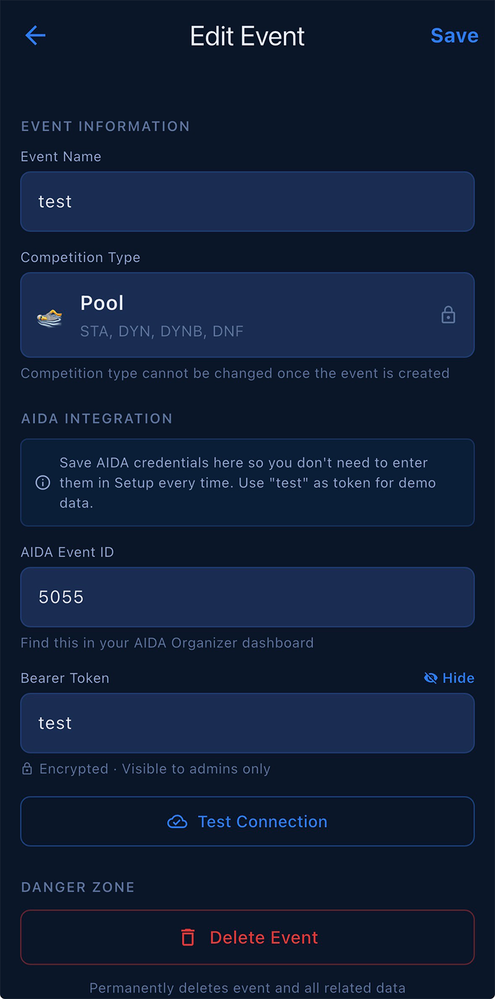
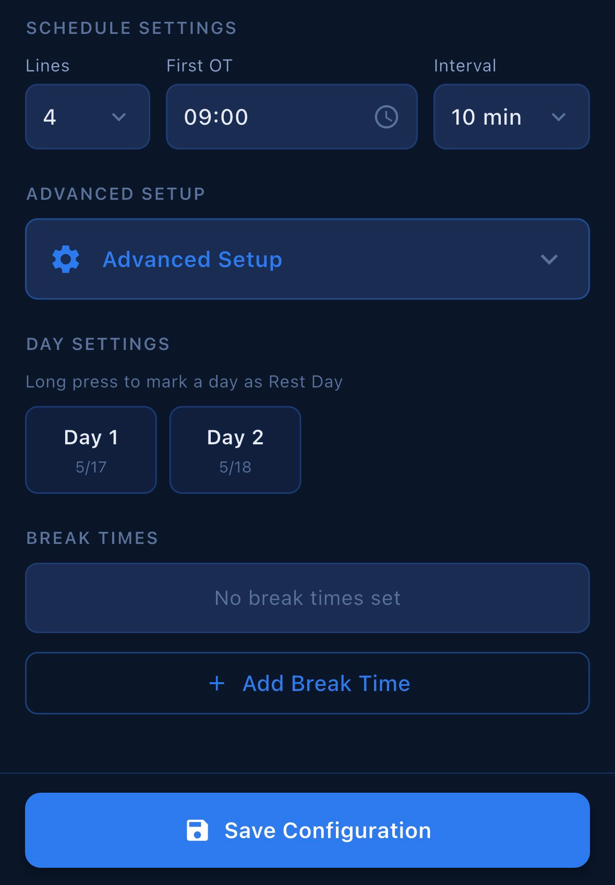
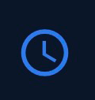
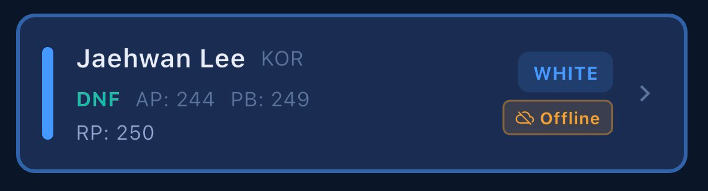
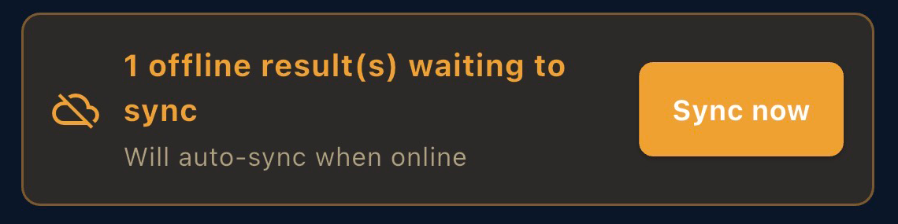

# Apnea Comp — 사용자 매뉴얼

**AIDA 대회 운영 시스템**

이 매뉴얼은 Apnea Comp으로 프리다이빙 대회를 운영하는 전 과정을 다룹니다 (셋업부터 결과까지). 앱 안의 Help (More → Help)는 빠른 참조용이고, 이 문서는 실제 운영 시나리오와 트러블슈팅을 포함한 더 자세한 가이드입니다.

5분만 시간이 있다면 아래 **빠른 시작**과 마지막의 FAQ를 읽으세요.

---

## 목차

1. [시작하기 전에](#시작하기-전에)
2. [빠른 시작](#빠른-시작)
3. [역할별 권한](#역할별-권한)
4. [이벤트 생성 (Organizer)](#이벤트-생성-organizer)
5. [이벤트 참여 (Staff)](#이벤트-참여-staff)
6. [선수로 참여하기](#선수로-참여하기)
7. [Setup: 선수, 라인, OT](#setup-선수-라인-ot)
8. [체크인](#체크인)
9. [판정 결과 입력](#판정-결과-입력)
10. [페널티 (룰북 17.7)](#페널티-룰북-177)
11. [일정 조정 (OT Delay)](#일정-조정-ot-delay)
12. [푸시 알림](#푸시-알림)
13. [오프라인 동작](#오프라인-동작)
14. [AIDA 연동](#aida-연동)
15. [멀티데이 이벤트](#멀티데이-이벤트)
16. [결과 및 내보내기](#결과-및-내보내기)
17. [FAQ](#faq)
18. [트러블슈팅](#트러블슈팅)
19. [개인정보 및 데이터](#개인정보-및-데이터)
20. [연락처](#연락처)

---

## 시작하기 전에

다음이 필요합니다:

- Apnea Comp 앱이 설치된 iPhone 또는 Android 디바이스
- 안정적인 인터넷 연결 (대회 중에는 선택사항 — [오프라인 동작](#오프라인-동작) 참조)
- 공식 점수가 매겨질 대회라면 AIDA International 계정 (Organizer만)
- Organizer용: 해당 대회의 AIDA Token과 Event ID. 없으면 앱은 🧪 Mock 모드로 동작 (샘플 데이터, AIDA 연동 없음)

각 심판/스태프는 본인 디바이스를 사용하는 것을 권장합니다. 앱은 같은 이벤트에서 여러 명이 동시 작업하는 것을 지원하며, 결과는 디바이스 간에 실시간 동기화됩니다.

---

## 빠른 시작

### Organizer (이벤트 생성자)

1. 앱을 열고 Events 화면에서 **+** 탭.
2. 이벤트 이름, 종류 (Pool / Depth / Team), 날짜를 입력하고 Create.
3. 이벤트 열기 → **Edit Event** → **AIDA Token**과 **AIDA Event ID** 입력 → **Test Connection** 탭 → Save.
4. Setup 탭 → **Load Athletes**로 AIDA에서 시작 명단을 가져옴.
5. Setup 탭 → **Lines** (라인 수), **First OT**, 선수 간 **Interval** 설정.
6. Edit Event에서 보이는 이벤트 **invite code**를 스태프에게 공유.
7. 스태프가 입장하면 **Users** 탭에서 승인 (Pending 상태로 나타남).

### Staff (심판, 체크인 담당자 등)

1. 앱을 열고 로그인.
2. Events 화면 → **Join with code** 탭 → 초대 코드 입력.
3. Organizer가 승인하고 역할 (Judge, Main Judge, Staff 등)을 부여할 때까지 Pending 상태로 대기.

### 선수

1. 앱을 열고 이메일로 가입.
2. 가입 시 **I am an athlete (선수입니다)** 선택.
3. 앱이 AIDA 시작 명단에 본인 이름이 있는지 자동 매칭.
4. 매칭되면 등록된 이벤트가 즉시 표시됨. 동명이인이 있으면 Organizer에게 일회용 초대 코드를 요청.

이제 대회 진행 준비 완료.

---

## 역할별 권한

| 역할 | Setup | Judge | Check-in | Users | Log | OT Delay | 푸시 발송 |
|------|-------|-------|----------|-------|-----|----------|-----------|
| 👑 Organizer | ✅ | ✅ | ✅ | ✅ | ✅ | ✅ | ✅ |
| ⚖️ Main Judge | ✅ | ✅ | ✅ | ✅ | ✅ | ✅ | ✅ |
| ✏️ Judge | — | ✅ | ✅ | — | — | — | — |
| 👀 Staff | — | 조회 | ✅ | — | — | — | — |
| 🏊 Athlete | — | — | — | — | — | — | — |
| ⏳ Pending | — | — | — | — | — | — | — |

- **Organizer**는 이벤트 생성자에게 부여되는 기본 역할.
- **Main Judge**는 Organizer와 동일한 권한. Users에서 부여.
- **Athlete**는 읽기 전용 — 시작 명단과 본인 결과만 조회. 다른 멤버 정보, AIDA 토큰, 운영 기능 접근 불가.
- **Pending** 멤버는 Organizer 또는 Main Judge가 Users에서 승인하고 실제 역할을 부여할 때까지 대기.

---

## 이벤트 생성 (Organizer)

### 기본 정보

- **이름** — 스태프에게 표시됨.
- **종류** — 🏊 Pool, 🌊 Depth, 또는 👥 Team.
- **날짜** — 멀티데이 이벤트의 경우 시작일과 종료일 선택.

### AIDA 연동 (권장)

이벤트 열기 → **Edit Event** → 입력:

- **AIDA Token** — AIDA 관리자 패널에서 발급.
- **AIDA Event ID** — AIDA 대회의 숫자 ID.

**Test Connection** 탭. 초록 체크가 나오면 자격 증명이 유효하고 시작 명단을 읽을 수 있다는 뜻. Save.

> 

비워두거나 토큰을 `test` 또는 `demo`로 설정하면 앱은 🧪 **Mock 모드**로 동작 — 연습용 샘플 선수를 생성합니다. Mock 모드는 AIDA로 아무것도 전송하지 않습니다.

### 스태프 초대

초대 코드는 **Edit Event**에 표시됩니다. 평소 사용하는 채널 (채팅, 이메일, 종이)로 공유하세요. 스태프는 Events 화면의 **Join with code**로 코드를 입력합니다.

> 팁: 초대 코드 회전(rotation)은 아직 지원되지 않습니다. 비밀번호처럼 다루고, 팀에 들어와야 할 사람과만 공유하세요.

---

## 이벤트 참여 (Staff)

1. 앱에 로그인.
2. Events 화면에서 **Join with code** 탭.
3. 코드를 붙여넣음. 이벤트가 **Pending** 상태로 목록에 나타남.
4. Organizer의 승인과 역할 부여를 기다림. 승인되면 이벤트가 탭 가능해짐.

실수로 잘못된 코드를 사용했다면 Organizer에게 Users에서 본인을 제거 요청 후 다시 시도.

---

## 선수로 참여하기

대회를 운영하지 않고 출전하는 입장이라면 선수로 가입해서 본인의 시작 명단, OT, 라인, 결과를 조회할 수 있습니다.

### 동작 방식

가입 시 앱이 본인의 이름을 읽고, organizer들이 AIDA에서 이미 로드한 선수들과 매칭을 시도합니다. 정확히 한 명과 일치하면 자동 연결. 그렇지 않으면 organizer가 일회용 초대 코드를 발급할 수 있습니다.

### Path A — 자동 매칭 (대부분의 경우)

1. 이메일로 가입.
2. **I am an athlete (선수입니다)** 선택.
3. **이름**, **성**, **성별**, **국적**을 AIDA에 등록된 그대로 입력.
4. 앱이 로드된 이벤트들을 검색. 이름이 1명과 일치하고 성별/국적도 일치하면 즉시 연결.
5. Events 화면에 본인이 등록된 이벤트들이 표시됨. 탭하면 시작 명단과 (이후) 결과를 볼 수 있음.

### Path B — 초대 코드 (동명이인일 때)

같은 이름의 선수가 두 명 이상이면 자동 매칭이 어느 쪽인지 결정할 수 없습니다. Organizer에게 초대 코드를 요청하세요:

1. Organizer가 이벤트 → **Athlete Invite Codes**에서 본인 이름을 찾아 탭하면 6자 코드 생성.
2. Organizer가 코드를 비공개로 전달.
3. 앱 → Events → **Enter invite code** → 코드 붙여넣기.
4. 앱이 코드를 검증하고 계정을 연결.

### 볼 수 있는 정보

- 🏊 Athlete 역할: 본인이 등록된 이벤트의 읽기 전용 접근.
- 시작 명단, 본인의 OT와 라인.
- 본인의 체크인 상태 (Pending / Checked-in / DNS / Late).
- 본인의 발행된 결과.

다른 선수의 개인 정보, 심판 노트, AIDA 토큰은 볼 수 없습니다.

### 푸시 알림

알림을 허용하면 다음을 받습니다:

- **시작 명단 발행** — Organizer가 그날의 시작 명단을 발행할 때.
- **비공식 / 공식 결과** — 결과가 발행될 때.
- **OT 지연** — 일정이 변경되어 본인 OT가 바뀔 때.
- **체크인 마감 임박 알림** — 자동 발송, 본인이 아직 체크인하지 않은 경우에만:
  - 체크인 마감 1시간 전 (= OT − 1h)
  - 체크인 마감 30분 전

알림은 디바이스 시스템 설정 또는 앱 About 화면에서 언제든 끌 수 있습니다.

---

## Setup: 선수, 라인, OT

> 

### 선수 로드

- **Load Athletes** — AIDA에서 등록된 시작 명단을 가져옴. 멱등 (idempotent): 다시 로드해도 기존 판정은 보존됨.
- **Mock 모드** — 연습용 샘플 시작 명단 생성.

### 라인 및 OT 설정

- **Lines** — 라인 수 (Pool: 레인, Depth: 플랫폼).
- **First OT** — 첫 선수의 시작 시각 (예: `09:00`).
- **Interval** — 같은 라인의 연속된 선수 간격.
- **Depth Line Interval** (Depth만) — 다른 라인의 두 선수 간 최소 간격. `(lines − 1) × line_interval < athlete_interval`을 만족해야 함. 그렇지 않으면 일정 생성 불가.

### 라인 배정

선수 로드 후 **Line Assignment**를 열어 라인 간 드래그 및 순서 변경. OT는 자동 재계산됨:

- Pool: 라운드로빈 배정. OT는 라인 내 위치에 따라 결정.
- Depth: 라인 순환을 포함한 전체 시퀀스. depth line interval 규칙 적용.

완료되면 Save — 그날의 시작 시각이 확정됩니다.

---

## 체크인

선수는 워밍업 전에 사인합니다. **Check-in** 탭을 엽니다.

- 체크인 대기 상태인 선수 카드를 탭하면 서명 시트가 열림.
- 선수가 화면에 서명 → **Save** 탭 → 현재 시각으로 Checked In 표시.
- No-show: 선수 탭 → **DNS** (Did Not Show) 확인.
- 마감 시각 이후 늦은 도착: 탭 → **Late Check-in**. 자동으로 "Late Check-in" remark가 있는 Red 카드 부여.

> 서명 그림은 시각적 확인용으로만 사용됩니다 — 체크인 순간 스태프 디바이스에서 보여지고, 시트가 닫히는 즉시 폐기됩니다. 서명 이미지는 어디에도 저장되지 않습니다 (서버에도, 디바이스에도). 서명이 이루어졌다는 사실과 체크인 시각만 기록됩니다.

> 체크인은 오프라인에서도 동작합니다. 디바이스가 오프라인일 때 확정하면 디바이스 메모리에 보관되고 카드에 작은 ⛔ "Offline" 배지가 표시되며, 재연결 후 5초 안에 서버와 자동 동기화됩니다. [오프라인 동작](#오프라인-동작) 참조.

---

## 판정 결과 입력

> 

Judge 탭은 현재 일자의 모든 선수를 표시합니다. 카드를 탭해서 결과를 입력합니다.

### 결과 입력

1. **RP** — 실현 기록 (static: 시간, dynamic: 거리, depth: 깊이).
2. **카드** — White (클린), Yellow (페널티), Red (DQ).
3. **페널티 사유** — White 외 카드 선택 시 필수. [페널티](#페널티-룰북-177) 참조.
4. **Start offset** — 빠른 출발 (음수) 또는 늦은 출발 (양수) 초. 출발 윈도우 페널티 계산에 사용.
5. **REMARKS** — 특정 사유 (BO, Other Penalty, DQ Other 등)에 필수. 앱이 템플릿을 미리 채워주니 빠진 부분만 작성.
6. **Save Result** 탭.

### 카드 배지

저장 후 선수 카드에 작은 배지가 표시됩니다:

- **✅ AIDA** — AIDA International에 동기화됨.
- **🔁 Retry** — AIDA 동기화 실패. 탭하면 사유 확인 및 재시도.
- **⛔ Offline** — 이 디바이스에 로컬 저장됨. 다시 온라인되면 자동 동기화. [오프라인 동작](#오프라인-동작) 참조.

배지가 없으면 AIDA 연동이 설정되지 않은 것 (해당 선수에 startId 없음) — Mock 모드에서는 정상.

---

## 페널티 (룰북 17.7)

앱은 AIDA Rulebook 17.7 섹션을 따릅니다. 사유는 카드 색상으로 그룹화됩니다.

### 🟨 Yellow 카드 사유

- **Start** — 잘못된 시작 기술 (Pool DYN: 벽 시작 실패 등).
- **Early Start** — OT 전에 출발. 출발 윈도우 내 5초당 1점.
- **Late Start** — OT 후에 출발. 출발 윈도우 내 5초당 1점.
- **Grab** — 수행 중 라인, 벽, 또는 플랫폼을 잡음.
- **Other Penalty** — 위에 해당하지 않는 것. **REMARKS 필수**.

### 🟥 Red 카드 사유

- **Surface Protocol** — 수면 후 15초 내 surface protocol 부정확.
- **Blackout Surface** — 수면에서 운동 통제 상실 또는 의식 상실. **REMARKS 필수** (회복 시간 등).
- **Blackout UW** — 수중에서 의식 상실. **REMARKS 필수**.
- **DQ Late Start** — Late Start가 출발 윈도우 초과 (Pool +10s, Depth +30s).
- **Jump Start** *(Pool DYN만)* — OT 전에 벽을 떠남.
- **DQ Other** — 기타 사유로 실격. **REMARKS 필수**.

### 출발 윈도우

| 종목 | 윈도우 | 윈도우 내 | 윈도우 초과 |
|------|--------|-----------|-------------|
| Pool | ±10 s | 5초당 1점 (Yellow Early/Late Start) | 늦은 쪽: DQ Late Start (Red); Pool DYN의 빠른 벽 출발: Jump Start (Red) |
| Depth | ±30 s | 5초당 1점 (Yellow Early/Late Start) | 늦은 쪽: DQ Late Start (Red) |

### REMARKS

AIDA Rulebook 4.1.16.2은 모든 Yellow와 Red에 서면 사유를 요구합니다. 사유에 REMARKS가 필수인데 비어있으면 Save 버튼이 동작을 차단합니다.

사유 선택 시 REMARKS 필드에 템플릿이 미리 채워집니다 (예: `BO Surface, recovery: ___`). 빠진 부분을 채운 후 저장 — 이것이 공식 기록입니다.

Red 카드는 다중 선택 지원 (예: Surface Protocol + Blackout Surface). 해당하는 사유들을 모두 탭.

---

## 일정 조정 (OT Delay)

대회가 지연될 때 (워밍업 길어짐, 사고, 장비 문제 등) 시작 명단을 다시 만들지 않고 남은 OT를 밀 수 있습니다.

### 위치

**Start List** 또는 **Judge** 탭의 AppBar 우측, 역할 배지 직전에 🕒 아이콘이 있습니다. **Organizer와 Main Judge에게만 표시됩니다.**

> 

### 사용법

1. 🕒 탭 → **Adjust Schedule** 다이얼로그가 열림.
2. 지연 시작점 선수 선택 (이 선수부터 OT가 밀림).
3. 지연 시간을 **분** 단위로 입력 (정수, 양수만).
4. 미리보기에서 영향받는 각 선수의 시간 변화 확인 (이전 → 이후).
5. **Apply** 탭.

선택한 선수부터 모든 OT가 그 시간만큼 뒤로 밀립니다. 해당 체크인/워밍업 시각도 함께 밀립니다.

### 부수 효과

- **푸시 알림** — OT가 변경된 모든 선수에게 자동 푸시: *"Your OT has been delayed by N minute(s)"*. 별도 구독이 필요 없으며, 영향받은 선수에게만 발송.
- **활동 로그** — Log 화면에 기록.

### 주의

- 양수 지연만 지원. 더 빠르게 당기는 것은 불가.
- Undo는 **아직 지원되지 않음** — Apply 전에 미리보기를 신중히 확인.
- 모든 스태프 디바이스가 실시간으로 업데이트됨.

---

## 푸시 알림

Apnea Comp는 시간 민감한 이벤트 업데이트에 푸시 알림을 사용합니다. 알림은 Firebase Cloud Messaging을 통해 전달됩니다.

### 알림 종류

수동으로 발송하는 알림과 시스템이 이벤트 상태에 따라 자동 발송하는 알림 두 가지가 있습니다.

#### 수동 (Organizer / Main Judge만)

More 메뉴에서 **Send Push**를 열면 작은 패널에 세 버튼이 있습니다. 각각 선택한 일자의 모든 등록 선수에게 발송:

- **Publish Start List** — 그날의 라인과 OT가 확정될 때.
- **Unofficial Results** — 선수 검토용 초기 결과 발행.
- **Official Results** — protest 윈도우 후의 최종 결과.

각 탭마다 발송 전 수신자 수가 표시되는 확인 다이얼로그가 뜸.

#### 자동

스태프 작업 없이 실행됩니다:

| 트리거 | 수신자 | 시점 |
|--------|--------|------|
| OT Delay 적용 | 영향받은 선수만 | Organizer / Main Judge가 지연을 적용한 즉시 |
| 체크인 마감 임박 (1시간) | 미체크인 선수 | OT 2시간 전 (= 체크인 마감 1시간 전) |
| 체크인 마감 임박 (30분) | 미체크인 선수 | OT 1.5시간 전 (= 체크인 마감 30분 전) |

선수가 체크인되거나 DNS / Late로 표시되면 알림 발송이 중단됩니다.

### 알림을 받는 사용자

다음을 모두 만족하는 사용자만:

- 연결된 선수 계정 (위의 Path A 또는 Path B)
- OS 수준에서 알림 허용
- 앱 내 알림 활성화 (기본값: on)
- 활성 푸시 토큰 (앱을 한 번 이상 실행하면 생성됨)

### 알림 비활성화

- iPhone: 설정 → Apnea Comp → 알림 → 끄기.
- Android: 설정 → 앱 → Apnea Comp → 알림 → 끄기.
- 앱 내: More → About → 알림 토글.

비활성화하면 푸시 토큰이 즉시 서버에서 삭제됩니다.

---

## 오프라인 동작

앱은 풀/암반 환경에서 흔히 발생하는 인터넷 끊김 상황에서도 계속 동작하도록 설계되었습니다.

### 연결 끊김 시 동작

상단에 **"You are offline"** 빨간 바가 나타납니다. 다음은 가능:

- ✅ Judge 결과 저장 (로컬 저장, 나중에 동기화)
- ✅ 선수 체크인 (로컬 저장, 나중에 동기화)
- ❌ AIDA에서 새 선수 명단 로드
- ❌ 푸시 알림 수신 (재연결 후 전달, FCM이 큐에 보관)

### Offline 배지

> 

오프라인에서 결과를 저장하면 선수 카드에 AIDA 동기화 배지 대신 작은 **⛔ Offline** 배지가 표시됩니다. 의미:

- 결과는 디바이스 메모리에 **안전**하게 보관.
- **아직** 서버에 도달하지 않음.
- 앱이 백그라운드에서 5초마다 자동 재시도.

인터넷이 복구되면 배지가 자동으로 **✅ AIDA**로 변경. 수동 작업 불필요.

### 수동 동기화

자동 재시도가 따라잡지 못한 경우 **Results** 열기:

> 

대기 중인 항목이 있으면 주황색 배너가 표시됨:

- **"N개의 오프라인 결과가 동기화 대기 중"**과 **Sync now** 버튼 — 즉시 재시도.
- **"M개의 결과가 AIDA에 동기화되지 않음"**과 **Resync** 버튼 — AIDA 측 실패 (토큰, 서버 오류 등).

### ⚠️ 중요

오프라인 결과는 동기화될 때까지 디바이스 메모리에 있습니다. **오프라인 항목이 대기 중일 때 앱을 강제 종료하거나 폰을 재부팅하지 마세요** — 손실됩니다. ⛔ 배지가 모두 사라질 때까지 기다리거나, 종료 전 Sync now를 탭하세요.

확실하지 않으면 Results를 열고 주황 배너를 확인. 배너 없음 = 대기 항목 없음.

---

## AIDA 연동

### 토큰 발급

<https://www.aidainternational.org>의 AIDA International 관리자 계정으로 로그인. 등록한 대회를 열고 API / Integration 섹션에서 다음을 복사:

- **AIDA Token** — 긴 영문/숫자 문자열.
- **AIDA Event ID** — 보통 4~6자리 숫자.

이 옵션이 보이지 않으면 이벤트를 등록한 AIDA 관리자가 공유해야 하거나, 본인 계정 권한 업데이트가 필요합니다.

### 앱에 설정

Edit Event → 두 값 입력 → Test Connection → Save. 앱은 토큰을 서버에 안전하게 캐시합니다 (URL에 노출되지 않음). 토큰 업데이트 시 다음 저장부터 즉시 새 값 사용 (앱 재시작 불필요).

### 동기화되는 데이터와 시점

- **읽기** — Setup → Load Athletes로 시작 명단 (이름, AP, PB, 종목) 가져옴.
- **쓰기** — Judge에서 Save할 때마다 결과 (RP, 카드, 사유, remarks, start offset)를 전송. 백그라운드, 비차단.

### 동기화 실패 시

- **토큰 만료/무효** → 빨간 SnackBar: *"AIDA token invalid — update in Edit Event"* (Organizer / Main Judge) 또는 *"ask Organizer to update"* (다른 역할). 토큰 업데이트 후 Results → Resync.
- **네트워크 오류** → 카드에 🔁 Retry 배지. 탭하면 오류 메시지 확인 및 재시도, 또는 Results → Resync로 일괄 처리.
- **오프라인** → ⛔ Offline 배지. 온라인 시 자동 재시도. [오프라인 동작](#오프라인-동작) 참조.

### Mock 모드

토큰을 `test` 또는 `demo`로 설정하거나 두 필드를 비워두면 AIDA 없이 동작. 앱이 샘플 선수를 생성하고 아무것도 전송하지 않음. 트레이닝, 드라이런, 데모용. Mock 모드 이벤트는 실제 날짜를 무시하므로 카운트다운과 음성 안내가 즉시 동작 — 테스트에 적합합니다.

---

## 멀티데이 이벤트

여러 날에 걸친 대회의 경우:

- Setup → **Total Days** → 대회 일수 설정.
- 각 일자는 자체 시작 명단, 체크인, 결과, OT를 가짐.
- 일자가 둘 이상이면 AppBar 아래에 **Day selector** 표시. 탭해서 전환.
- **Rest day**: Setup에서 표시. 일정 생성에서 건너뜀.

데이터는 일자 간에 **이월되지 않음** — Day 2에서 선수 이동해도 Day 1에 영향 없음. 일자별 합산 점수는 Results에서 계산.

이벤트가 AIDA에 멀티데이로 등록되어 있으면 Load Athletes가 일자별 시작 명단을 자동으로 가져옵니다.

---

## 결과 및 내보내기

**Results** 탭은 판정이 들어올 때마다 라이브 순위를 업데이트합니다.

- 상단 **요약 카드**: 전체 선수, white / yellow / red, AP / PB / RP.
- **종목 필터**로 좁히기.
- **동기화 배너** (있을 시): Offline 대기, AIDA 대기, 토큰 문제.
- **선수 목록** 점수 정렬, 탭하면 상세.
- **Export** — 게시판 게시 또는 선수 발송용 CSV / 이미지 공유.

---

## FAQ

### 스태프 폰의 배터리가 떨어지면 입력한 결과를 잃나요?

아니요. 결과를 저장하는 즉시 서버 (오프라인이면 디바이스)에 저장됩니다. 같은 이벤트의 다른 디바이스가 결과를 즉시 봅니다. 폰이 영구히 분실되어도 동기화되지 않은 오프라인 결과만 위험에 노출됩니다 — 그 시점에 대기 중인 것이 있을 때만.

### 두 사람이 같은 선수의 다른 결과를 저장하면?

마지막 저장이 적용됩니다. 앱은 현재 동시 편집 경고를 제공하지 않습니다. 보통 한 명의 심판이 결과를 입력하므로 구두로 조율하세요.

### 선수에 AP / PB는 표시되는데 startId는 없는데요?

Mock 모드에서 추가됐거나 AIDA 외부에서 수동 가져온 선수일 가능성. AIDA 동기화에는 startId가 필요 — 이 선수들의 결과는 AIDA로 전송되지 않음 (배지 없음). Results에는 정상 표시됩니다.

### AIDA 토큰을 변경했는데 이전 결과가 계속 실패합니다

Results 열기 → 배너에 "Update token & resync"가 보이면 탭. 새 토큰으로 대기 항목들이 재전송됩니다. 앱이 자격 증명을 서버에 캐시하고 Edit Event 저장 시 캐시를 갱신하므로 재시작 불필요.

### 체크인 중 인터넷이 끊기면?

체크인이 로컬에 저장되고 선수 카드에 작은 ⛔ "Offline" 배지가 표시됩니다. 연결 복구 즉시 (5초 안) 서버와 자동 동기화. 선수가 다시 서명할 필요 없음. 서명 그림 자체는 저장되지 않으며 그 순간 시각 확인용으로만 사용됩니다.

### 선수가 푸시 알림을 받지 못합니다

흔한 원인:

- 가입은 했지만 AIDA 선수 레코드와 연결되지 않음 (자동 매칭 실패, 초대 코드 미사용). 연결 없이는 시스템이 어떤 선수인지 알 수 없음.
- OS 수준에서 알림이 비활성화. iPhone: 설정 → Apnea Comp → 알림. Android: 설정 → 앱 → Apnea Comp → 알림.
- 새 디바이스에서 앱이 한 번도 실행되지 않음 — 푸시 토큰은 실행 시 발급됨.
- 선수가 DNS / Late / 이미 체크인됨 (이 경우 체크인 알림은 의도적으로 중단).

### 이벤트를 삭제할 수 있나요?

현재 이벤트는 보관(archive)할 수 있지만 영구 삭제는 안 됩니다. 삭제가 필요하면 (개인정보, GDPR 요청 등) 연락 주세요.

### 대회 중 앱을 계속 열어두어야 하나요?

네, 판정/체크인 작업 디바이스에서는. 앱은 백그라운드에서 동작하지 않습니다. 다른 앱으로 전환해도 화면 상태는 보존되지만, 오프라인 자동 재시도는 앱을 다시 열 때까지 멈춥니다.

푸시 알림 자체는 앱이 열려있지 않아도 됩니다 — 알림을 허용한 한, iOS / Android는 앱이 닫힌 상태에서도 전달합니다.

### 어떤 디바이스를 지원하나요?

iPhone (iOS 15+) 및 Android (Android 9+). 태블릿도 동작하지만 레이아웃은 폰 기준 최적화.

---

## 트러블슈팅

### Judge에서 "Could not save" 빨간 SnackBar

앱이 결과를 로컬에도 저장하지 못했다는 뜻 — 보통 선수는 로드되었지만 로컬 목록이 동기화 어긋났을 때 발생. **Reload** 탭 (Setup) 후 재시도. 진단을 위해 오류 메시지에 athlete ID와 현재 카운트가 포함됨.

### "AIDA token invalid"가 계속 뜸

- Edit Event에서 토큰에 앞뒤 공백이 없는지 확인.
- Test Connection 탭 — 성공하나?
- Test 실패 시: AIDA 관리자에게 새 토큰 발급 요청.
- Test 성공인데 저장만 실패: Results → Resync.

### 분명히 온라인인데 "You are offline"이 뜸

연결성 체크는 서버에 핑을 보냅니다. 서버가 잠시 도달 불가 (드물거나) 네트워크가 Supabase URL을 차단 (호텔/공공 wifi에서 흔치 않음)하면 표시기가 빨강으로 남을 수 있음. 어쨌든 결과를 저장해보세요 — 성공하면 표시기가 몇 초 안에 사라집니다.

### OT Delay 아이콘이 안 보임

확인:

- **Start List** 또는 **Judge** 탭에 있는지 (다른 탭에서는 숨겨짐).
- 역할이 Organizer 또는 Main Judge인지 (다른 역할은 안 보임).
- AppBar 우측, 역할 배지 직전.

### Line Assignment 후 일정이 이상함

OT 계산은 저장 시 실행됩니다. 선수 순서를 바꿨는데 OT가 잘못 보이면 위로 스크롤해서 **Save**를 다시 탭 — 시간이 순서와 일치해야 합니다. 그래도 이상하면 스크린샷과 함께 연락 주세요.

### 팀원이 Pending에서 막힘

Users 탭 → 이름 찾기 → 역할 부여 (Judge / Staff 등). 이벤트별로 승인 필요 — 승인은 이벤트 간에 이월되지 않습니다.

### 판정한 선수가 있는데 Results 화면이 비어있음

당겨서 새로고침. 그래도 비면 다른 탭으로 이동했다 다시 옴. 문제가 지속되면 스크린샷과 함께 연락 — 이런 일은 발생하면 안 됩니다.

### 폰을 바꾼 후 푸시 알림이 안 옴

새 폰에 로그인하고 앱을 한 번 실행. 새 디바이스의 푸시 토큰이 계정의 이전 토큰을 대체. 이전 폰은 더 이상 알림을 받지 않습니다.

---

## 개인정보 및 데이터

앱이 수집하는 데이터, 처리 방식, 사용자 권리에 대한 자세한 내용은 [개인정보처리방침](https://elfreediving.github.io/aida-competition-privacy/PRIVACY_POLICY_KO)을 참조하세요.

요약:

- **저장하는 것** — 계정 이메일, 표시 이름, 프로필 사진 (업로드한 경우), AIDA 선수 UUID (선수로 가입한 경우), 푸시 알림 토큰 (알림 활성화한 경우), 입력한 대회 데이터 (선수 결과, 체크인 상태, 활동 로그).
- **저장하지 않는 것** — 선수의 연락처, 사진, 생년월일, 서명 그림, AIDA가 공개적으로 노출하는 것 외의 개인 식별자.
- **위치** — Supabase (현재 미국 리전), 저장 시 암호화. Row-Level Security 정책으로만 접근. 데이터는 이벤트별로 격리. 푸시 알림은 Firebase Cloud Messaging (Google) 경유.
- **AIDA 토큰** — 암호화, Organizer / Main Judge 역할만 접근. URL이나 클라이언트 메모리에 필요 이상 노출되지 않음.
- **오프라인 버퍼링** — 오프라인에서 저장한 판정 결과는 앱 메모리에만 보관. 재연결 후 수 초 안에 동기화.

---

## 연락처

버그, 질문, 피드백:

- 이메일: lee33179@gmail.com
- GitHub issues: <https://github.com/elfreediving/apnea-comp-manual/issues>

문제 보고 시 다음을 포함:

- 디바이스 모델 및 OS 버전
- 앱 버전 (More → About)
- 관련 스크린샷
- 문제 발생 대략적 시각 (로그 매칭용)

---

*이 매뉴얼은 Apnea Comp 프로젝트의 일부입니다. GitHub 소스: <https://github.com/elfreediving/apnea-comp-manual>. 최종 업데이트: 2026-05-05.*
