# Apnea Comp — 사용자 매뉴얼

**AIDA 대회 운영 시스템**

이 매뉴얼은 Apnea Comp으로 프리다이빙 대회를 운영하는 전 과정을 다룹니다 (셋업부터 결과까지). 앱 안의 Help (More → Help)는 빠른 참조용이고, 이 문서는 실제 운영 시나리오와 트러블슈팅을 포함한 더 자세한 가이드입니다.

5분만 시간이 있다면 아래 **빠른 시작**과 마지막의 FAQ를 읽으세요.

---

## 목차

1. [시작하기 전에](#시작하기-전에)
2. [빠른 시작](#빠른-시작)
3. [역할별 권한](#역할별-권한)
4. [이벤트 생성 (Organizer)](#이벤트-생성-organizer)
5. [이벤트 참여 (Staff)](#이벤트-참여-staff)
6. [선수로 참여하기](#선수로-참여하기)
7. [Setup: 선수, 라인, OT](#setup-선수-라인-ot)
8. [Break Times (휴식 시간)](#break-times-휴식-시간)
9. [팀 대회 (Team)](#팀-대회-team)
10. [체크인](#체크인)
11. [Start List & Speaker Mode](#start-list--speaker-mode)
12. [판정 결과 입력](#판정-결과-입력)
13. [페널티 (룰북 17.8)](#페널티-룰북-178)
14. [이의제기 (Protest)](#이의제기-protest)
15. [재경기 & Opener](#재경기--opener)
16. [일정 조정 (OT Delay)](#일정-조정-ot-delay)
17. [푸시 알림](#푸시-알림)
18. [오프라인 동작](#오프라인-동작)
19. [AIDA 연동](#aida-연동)
20. [멀티데이 이벤트](#멀티데이-이벤트)
21. [결과 및 내보내기](#결과-및-내보내기)
22. [화면 & 언어](#화면--언어)
23. [FAQ](#faq)
24. [트러블슈팅](#트러블슈팅)
25. [개인정보 및 데이터](#개인정보-및-데이터)
26. [연락처](#연락처)

---

## 시작하기 전에

다음이 필요합니다:

- Apnea Comp 앱이 설치된 iPhone 또는 Android 디바이스
- 안정적인 인터넷 연결 (대회 중에는 선택사항 — [오프라인 동작](#오프라인-동작) 참조)
- 공식 점수가 매겨질 대회라면 AIDA International 계정 (Organizer만)
- Organizer용: 해당 대회의 AIDA Token과 Event ID. 없으면 앱은 🧪 Mock 모드로 동작 (샘플 데이터, AIDA 연동 없음)

각 심판/스태프는 본인 디바이스를 사용하는 것을 권장합니다. 앱은 같은 이벤트에서 여러 명이 동시 작업하는 것을 지원하며, 결과는 디바이스 간에 실시간 동기화됩니다.

---

## 빠른 시작

### Organizer (이벤트 생성자)

1. 앱을 열고 Events 화면에서 **+** 탭.
2. 이벤트 이름, 종류 (Pool / Depth / Team), 날짜를 입력하고 Create.
3. 이벤트 열기 → **Edit Event** → **AIDA Token**과 **AIDA Event ID** 입력 → **Test Connection** 탭 → Save.
4. Setup 탭 → **Load Athletes**로 AIDA에서 시작 명단을 가져옴.
5. Setup 탭 → **Lines** (라인 수), **First OT**, 선수 간 **Interval** 설정.
6. Edit Event에서 보이는 이벤트 **invite code**를 스태프에게 공유.
7. 스태프가 입장하면 **Users** 탭에서 승인 (Pending 상태로 나타남).

### Staff (심판, 체크인 담당자 등)

1. 앱을 열고 로그인.  
   *팁: **Remember email**을 체크하면 다음에 이메일이 자동으로 채워집니다. **Remember password**도 체크할 수 있는데, 이 경우 비밀번호는 기기의 보안 키 저장소(iOS Keychain / Android EncryptedSharedPreferences)에 보관되며 서버에는 저장되지 않습니다. 로그아웃하면 둘 다 삭제됩니다.*
2. Events 화면 → **Join with code** 탭 → 초대 코드 입력.
3. Organizer가 승인하고 역할 (Judge, Main Judge, Staff 등)을 부여할 때까지 Pending 상태로 대기.

### 선수

1. 앱을 열고 이메일로 가입.
2. 가입 시 **I am an athlete (선수입니다)** 선택.
3. 앱이 AIDA 시작 명단에 본인 이름이 있는지 자동 매칭.
4. 매칭되면 등록된 이벤트가 즉시 표시됨. 동명이인이 있으면 Organizer에게 일회용 초대 코드를 요청.

이제 대회 진행 준비 완료.

---

## 역할별 권한

| 역할 | Setup | Judge | Check-in | Users | Log | OT Delay | 푸시 발송 |
|------|-------|-------|----------|-------|-----|----------|-----------|
| 👑 Organizer | ✅ | ✅ | ✅ | ✅ | ✅ | ✅ | ✅ |
| ⚖️ Main Judge | ✅ | ✅ | ✅ | ✅ | ✅ | ✅ | ✅ |
| ✏️ Judge | — | ✅ | ✅ | — | — | — | — |
| 👀 Staff | — | 조회 | ✅ | — | — | — | — |
| 🏊 Athlete | — | — | — | — | — | — | — |
| ⏳ Pending | — | — | — | — | — | — | — |

- **Organizer**는 이벤트 생성자에게 부여되는 기본 역할.
- **Main Judge**는 Organizer와 동일한 권한. Users에서 부여.
- **Athlete**는 읽기 전용 — 시작 명단과 본인 결과만 조회. 다른 멤버 정보, AIDA 토큰, 운영 기능 접근 불가.
- **Pending** 멤버는 Organizer 또는 Main Judge가 Users에서 승인하고 실제 역할을 부여할 때까지 대기.

---

## 이벤트 생성 (Organizer)

### 기본 정보

- **이름** — 스태프에게 표시됨.
- **종류** — 🏊 Pool, 🌊 Depth, 또는 👥 Team.
- **날짜** — 멀티데이 이벤트의 경우 시작일과 종료일 선택.

### AIDA 연동 (권장)

이벤트 열기 → **Edit Event** → 입력:

- **AIDA Token** — AIDA 관리자 패널에서 발급.
- **AIDA Event ID** — AIDA 대회의 숫자 ID.

**Test Connection** 탭. 초록 체크가 나오면 자격 증명이 유효하고 시작 명단을 읽을 수 있다는 뜻. Save.

> 

비워두거나 토큰을 `test` 또는 `demo`로 설정하면 앱은 🧪 **Mock 모드**로 동작 — 연습용 샘플 선수를 생성합니다. Mock 모드는 AIDA로 아무것도 전송하지 않습니다.

### 스태프 초대

초대 코드는 **Edit Event**에 표시됩니다. 평소 사용하는 채널 (채팅, 이메일, 종이)로 공유하세요. 스태프는 Events 화면의 **Join with code**로 코드를 입력합니다.

> 팁: 초대 코드 회전(rotation)은 아직 지원되지 않습니다. 비밀번호처럼 다루고, 팀에 들어와야 할 사람과만 공유하세요.

---

## 이벤트 참여 (Staff)

1. 앱에 로그인.
2. Events 화면에서 **Join with code** 탭.
3. 코드를 붙여넣음. 이벤트가 **Pending** 상태로 목록에 나타남.
4. Organizer의 승인과 역할 부여를 기다림. 승인되면 이벤트가 탭 가능해짐.

실수로 잘못된 코드를 사용했다면 Organizer에게 Users에서 본인을 제거 요청 후 다시 시도.

---

## 선수로 참여하기

대회를 운영하지 않고 출전하는 입장이라면 선수로 가입해서 본인의 시작 명단, OT, Line, 결과를 조회할 수 있습니다.

스태프 보기와 선수 보기는 언제든 전환할 수 있습니다: 아바타(우측 상단) 탭 → **Switch to Athlete Mode** (되돌릴 때도 같은 방법).

### 동작 방식

가입 시 앱이 본인의 이름을 읽고, organizer들이 AIDA에서 이미 로드한 선수들과 매칭을 시도합니다. 정확히 한 명과 일치하면 자동 연결. 그렇지 않으면 organizer가 일회용 초대 코드를 발급할 수 있습니다.

### Path A — 자동 매칭 (대부분의 경우)

1. 이메일로 가입.
2. **I am an athlete (선수입니다)** 선택.
3. **이름**, **성**, **성별**, **국적**을 AIDA에 등록된 그대로 입력.
4. 앱이 로드된 이벤트들을 검색. 이름이 1명과 일치하고 성별/국적도 일치하면 즉시 연결.
5. Events 화면에 본인이 등록된 이벤트들이 표시됨. 탭하면 시작 명단과 (이후) 결과를 볼 수 있음.

### Path B — 초대 코드 (동명이인일 때)

같은 이름의 선수가 두 명 이상이면 자동 매칭이 어느 쪽인지 결정할 수 없습니다. Organizer에게 초대 코드를 요청하세요:

1. Organizer가 이벤트 → **Athlete Invite Codes**에서 본인 이름을 찾아 탭하면 6자 코드 생성.
2. Organizer가 코드를 비공개로 전달.
3. 앱 → Events → **Enter invite code** → 코드 붙여넣기.
4. 앱이 코드를 검증하고 계정을 연결.

### AIDA에서 나 찾기

> 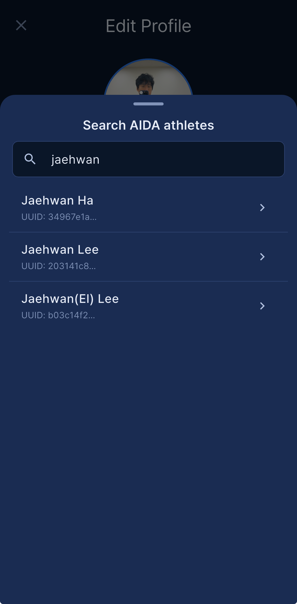

자동 매칭이 본인을 찾지 못하면 AIDA 선수 프로필을 직접 연결할 수 있습니다. **Edit Profile** 또는 **Athlete Setup**에서 **Find me on AIDA**를 탭하고 이름을 입력한 뒤 결과에서 본인 프로필을 선택하세요. 이렇게 하면 본인 AIDA athlete ID가 저장되어 결과가 정확히 매칭됩니다. 🔄 sync 아이콘은 본인이 등록된 이벤트도 가져옵니다. (대회 이력이 없는 선수는 검색에 안 나올 수 있는데, 그 경우 이름·국적·성별을 AIDA 등록 그대로 직접 입력하세요.)

### 볼 수 있는 정보

선수 모드는 4개 탭입니다: **My Info**, **Start List**, **Results**, **Rewards** (지난 대회는 Start List 없이 3개 탭).

- 🏊 Athlete 역할: 본인이 등록된 이벤트의 읽기 전용 접근.
- **My Info** — 본인의 OT, Line, 체크인 상태 (Pending / Checked-in / DNS / Late), 결과. 여기서 이의제기도 제출할 수 있습니다([이의제기](#이의제기-protest) 참조).
- **Start List** — 그날의 출전 순서. "Show my line only" 필터 제공.
- **Results** — 발행된 결과.
- **Rewards** — 종목·성별별 포인트 순위. 본인 행이 강조됨.

다른 선수의 개인 정보, 심판 노트, AIDA 토큰은 볼 수 없습니다.

### 푸시 알림

알림을 허용하면 다음을 받습니다:

- **시작 명단 발행** — Organizer가 그날의 시작 명단을 발행할 때.
- **비공식 / 공식 결과** — 결과가 발행될 때.
- **OT 지연** — 일정이 변경되어 본인 OT가 바뀔 때.
- **체크인 마감 임박 알림** — 자동 발송, 본인이 아직 체크인하지 않은 경우에만:
  - 체크인 마감 1시간 전 (= OT − 1h)
  - 체크인 마감 30분 전
- **이의제기 업데이트** — 본인 관련 이의제기가 대리 제출되어 서명이 필요하거나, jury가 결정했을 때.

알림은 본인이 선택한 앱 언어로 도착합니다. 디바이스 시스템 설정 또는 앱 About 화면에서 언제든 끌 수 있습니다.

---

## Documents (동의서)

많은 대회에서 출전 전에 선수가 AIDA 동의서를 제출해야 합니다. **My Info → Documents**를 엽니다.

- **필수 양식** — Competition Entry, Image Rights 동의서, Liability 면책 동의서. **Medical Statement**는 선택 사항이지만 자주 요구됩니다.
- **제출 방법 2가지** — *앱에서 작성*(항목을 입력하고 화면에서 서명하면 PDF가 자동 생성됨) 또는 서명된 종이 사본의 *사진 업로드*.
- **Medical Statement** — 발급일로부터 1년간 유효합니다. 프로필에 저장(Edit Profile → Medical Statement)하면 여러 대회에서 재사용할 수 있습니다. 사진을 업로드하는 경우 증명서에 표시된 발급일을 입력하세요. 발급일 *이후*에 압력 손상이나 블랙아웃이 발생하면 증명서는 무효가 되므로 새로 제출해야 합니다.
- **마감** — 대회 전날까지 필수 양식이 누락되어 있으면 누락된 항목을 알리는 푸시 알림을 받습니다.

**스태프용 (Organizer / Main Judge):** **More → Documents**를 열어 각 선수의 제출 상태를 확인하고, 파일을 열고, **전체를 ZIP으로 다운로드**할 수 있습니다(문서 유형별 폴더). 선수가 부상이나 블랙아웃을 신고하면 해당 medical statement는 **수동 확인** 대상으로 표시됩니다. 증명서를 직접 확인한 후 *Mark verified*를 탭하세요. 제출된 문서는 대회 종료 후 15일간 보관되며 이후 삭제됩니다.

---

## Setup: 선수, 라인, OT

> 

Setup은 그날의 일정을 결정하는 곳입니다: 어느 선수가 어느 라인에서 다이빙하는지, OT(공식 시간)는 언제인지, 그날 어떤 휴식이 들어가는지.

**자동 저장** — Setup에서 변경한 모든 내용은 자동으로 서버에 저장됩니다. 앱을 닫았다가 다시 열어도 설정이 복원됩니다. 다른 운영자가 AIDA에서 선수를 다시 로드해도 라인 구성은 유지됩니다.

### 선수 로드

- **Load Athletes** — AIDA에서 등록된 시작 명단을 가져옴. 멱등 (idempotent): 다시 로드해도 기존 판정은 보존됨.
- **Mock 모드** — 연습용 샘플 시작 명단 생성.

### 라인 및 OT 설정 (기본)

- **Lines** — 라인 수 (Pool: 레인, Depth: 플랫폼).
- **First OT** — 첫 선수의 시작 시각 (예: `09:00`).
- **Interval** — 같은 라인의 연속된 선수 간격.
- **Depth Line Interval** (Depth / Team만) — **ON**이면 각 Line이 순차로 진행됩니다: Line별로 시작 오프셋이 어긋나게 적용되고(Line 1, 몇 분 뒤 Line 2 …), Start List에 Line별 카운트다운이 표시됩니다. 오프셋은 `(lines − 1) × line_interval < athlete_interval`을 만족해야 하며, 아니면 일정 생성 불가. **OFF**이면 모든 Line이 **병렬**로 진행되어 같은 행의 선수가 같은 OT를 가집니다 — Pool 모드와 동일.

### Advanced Setup (선택, 접기/펴기)

> 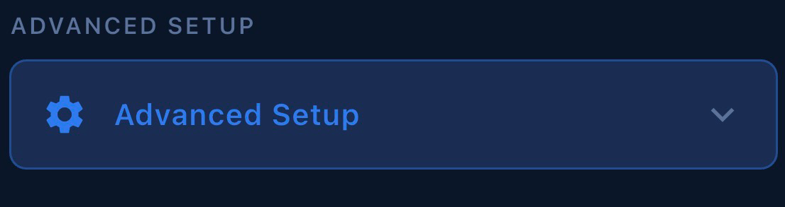
> 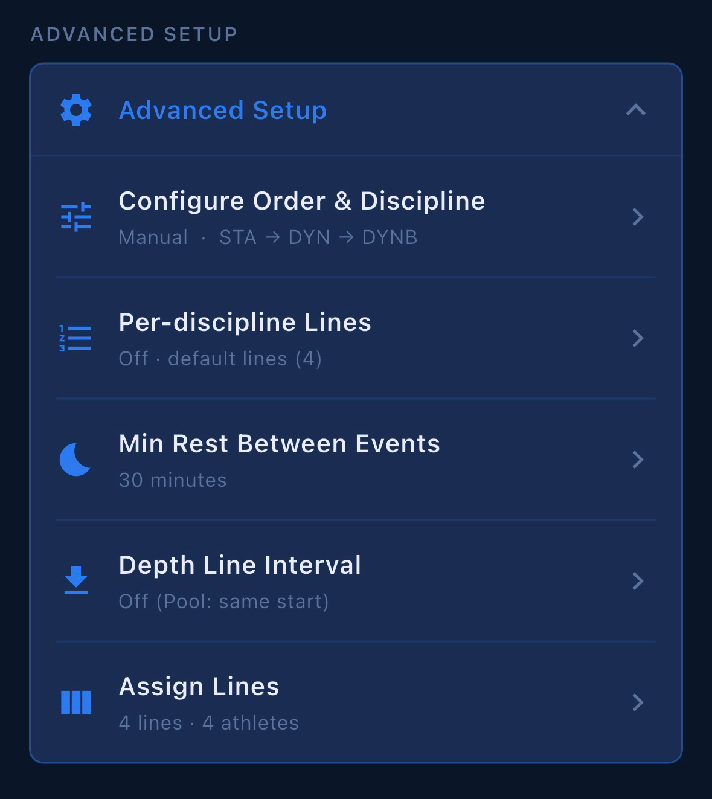

**Advanced Setup** 카드를 탭하여 펼치면 세부 옵션이 보입니다:

- **종목별 라인 수 (Per-discipline lines, Pool만)** — 종목마다 다른 라인 수 지정 가능. 예: STA는 4개 레인, DYN/DNF는 2개 레인. 앱이 종목별 하위 일정을 만든 후 이어 붙입니다.
- **종목 간 라인 carry-over** — 이전 종목이 라인 중간에 끝났을 때 (예: STA가 4레인 중 3레인에서 끝남) 다음 종목을 1번 레인부터 다시 시작할지(기본값) 또는 4번 레인부터 이어갈지 선택. 같은 라인에서 종목을 이어가는 운영에 유용.

- **Custom Intervals (인터벌 개별 지정)** — 기본 인터벌 외에, 시작 순서 번호 범위마다 다른 인터벌을 줍니다. 예: #1–#10 → 10분, #11–#20 → 8분, #21–#30 → 7분. **Add interval(인터벌 추가)** 탭 → *시작 순서 / 끝 순서 / 인터벌* 설정 → **Done**. OT가 자동 재계산·저장됩니다. Day별 설정이며, 범위는 겹치면 안 되고 선수 수 이내여야 합니다. 범위가 없으면 전체에 기본 인터벌 적용. 해당 Day에 수동 브레이크가 있으면 OT 재계산은 건너뜁니다(Save Configuration과 동일 — 수동 조정한 OT 보호).

### 라인 배정

선수 로드 후 **Assign Lines**를 열어 Line 간 이동 및 순서 변경. OT는 자동 재계산됨:

- Pool: 라운드로빈 배정. OT는 Line 내 위치에 따라 결정.
- Depth: Line 순환을 포함한 전체 시퀀스. depth line interval 규칙 적용.

**직접 Line 지정** — 특수한 경우(예: 국가 기록 시도용 특정 Line 예약, 또는 재경기 배치 — [재경기 & Opener](#재경기--opener) 참조)에는 선수를 탭한 뒤 목표 Line과 위치를 탭하세요. 일정이 재구성됩니다.

완료되면 Save — 그날의 시작 시각이 확정됩니다.

---

## Break Times (휴식 시간)

휴식은 일정에 정해진 시간 동안 공백을 만듭니다. 두 종류를 지원합니다.

### 시간 기준 휴식 (Lunch Break 등)

> 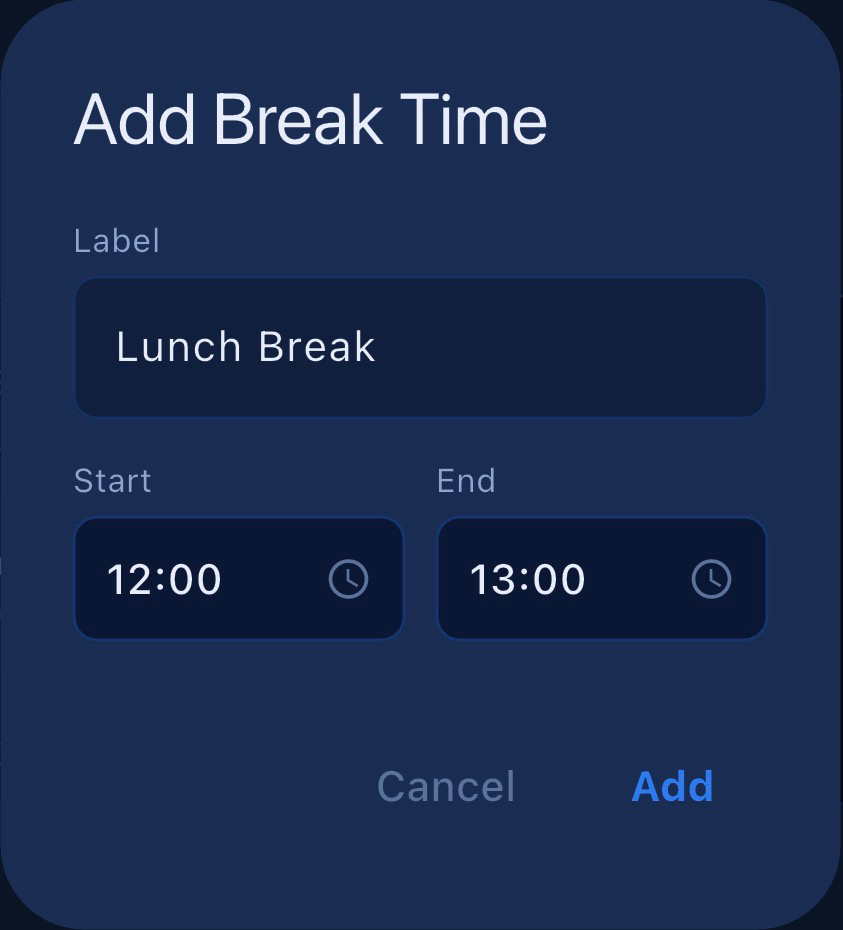

모든 사람이 미리 합의한 고정 시각의 휴식(점심, 시상식 등)에 사용:

1. Setup → **BREAK TIMES** → **Add Break Time** 열기.
2. **Time-based** 선택.
3. 시작 시각과 종료 시각 입력 (예: `12:00` – `13:00`).
4. 저장.

휴식 윈도우 안에 OT가 포함되는 선수는 휴식 종료 후로 OT가 밀립니다. 라인 배정은 유지됩니다.

### After Athlete 휴식 (Build 48 신규)

> 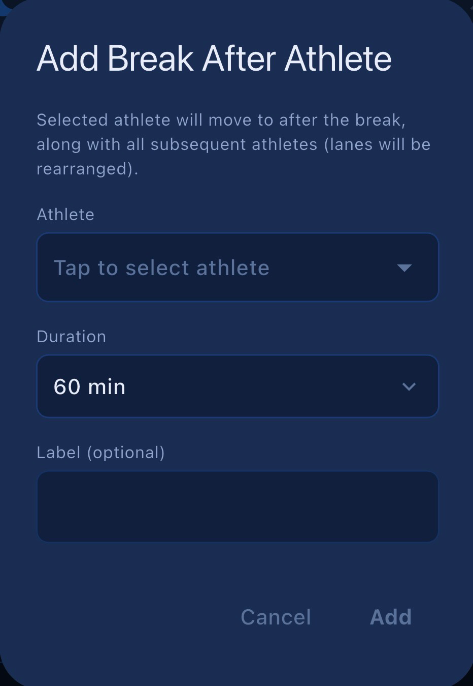
> 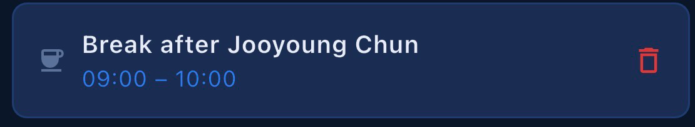

특정 선수가 끝난 후에 휴식을 넣고 싶을 때 사용 (시계 시간과 무관). 전형적 시나리오: 워밍업 선수들이 끝난 후 공식 선수가 시작하기 전 60분 휴식.

1. Setup → **BREAK TIMES** → **Add Break Time** 열기.
2. **After Athlete** 선택.
3. 휴식이 들어갈 기준 선수(이 선수까지 끝나면 휴식 시작)를 선택.
4. 휴식 시간(분) 입력 (예: `60`).
5. 저장.

선택된 선수와 **그 이후 정렬 순서의 모든 선수**가 휴식 시간만큼 뒤로 밀립니다. 다른 종목(정렬 순서가 앞이고 시계 시간만 같은 선수)은 영향을 받지 않습니다. 라인 배정은 유지됩니다.

삭제하려면 BREAK TIMES 목록의 🗑️ 휴지통 아이콘을 탭하세요.

---

## 팀 대회 (Team)

Team 종류 대회는 선수를 팀으로 묶고 팀 합산 점수로 순위를 매깁니다. **Setup**에 **Teams** 섹션이 나타나며, Team 종류 대회에서만 표시됩니다.

> 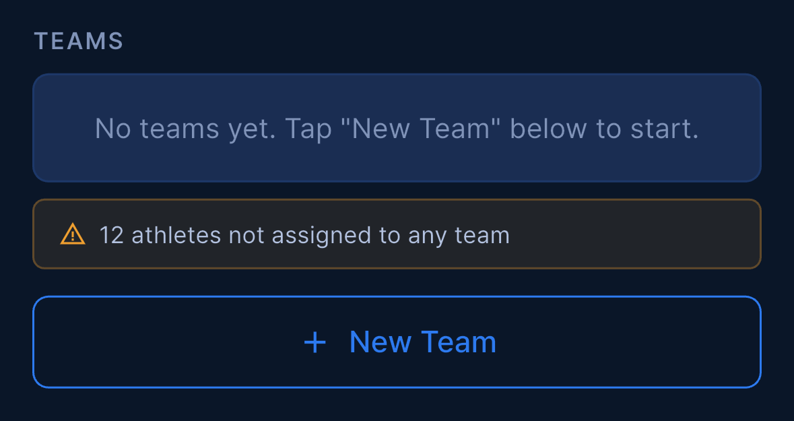

### 팀 생성 및 편집

**New Team**을 탭하면 팀 편집기가 열립니다.

> 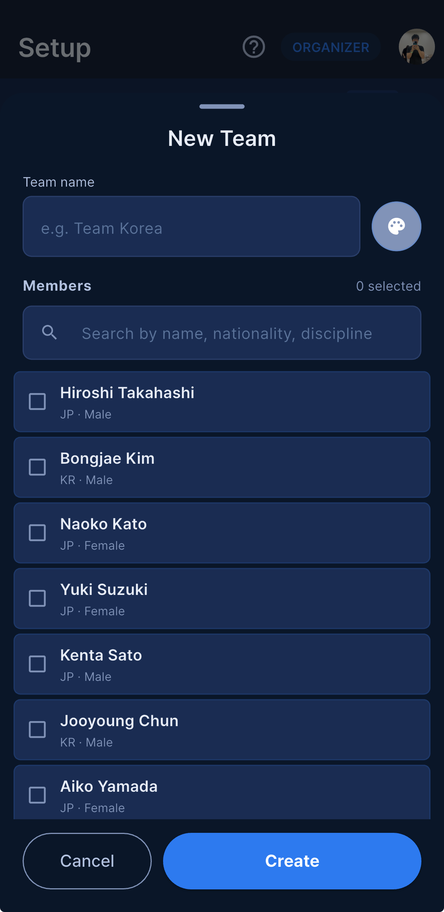

- **이름** — 필수.
- **색(Color)** — 목록에서 팀을 쉽게 구분하도록 색을 고릅니다.
- **멤버** — 팀에 속한 선수를 체크합니다. 목록은 이름·국적으로 검색됩니다. 이미 다른 팀 소속인 선수를 선택하면 그 팀으로 이동됩니다.

각 팀 카드에 이름·색·멤버 수가 표시됩니다. 카드를 탭해 **편집**하거나, 메뉴로 **삭제**합니다.

> 여러 날 출전하는 선수는 한 번만 표시됩니다 — 선택하면 그 선수의 **모든 날 엔트리**가 해당 팀에 배정되므로, 사람마다 한 번씩만 고르면 됩니다.

---

## 체크인

선수는 워밍업 전에 사인합니다. **Check-in** 탭을 엽니다.

- 체크인 대기 상태인 선수 카드를 탭하면 서명 시트가 열림.
- 선수가 화면에 서명 → **Save** 탭 → 현재 시각으로 Checked In 표시. 이후 카드에 OT와 체크인 시각이 함께 표시됨.
- No-show: 선수 탭 → **DNS** (Did Not Show) 확인.
- 마감 시각 이후 늦은 도착: 탭 → **Late Check-in**. 자동으로 "Late Check-in" remark가 있는 Red 카드 부여.
- **자동 Late Check-in** — 체크인 마감(OT − 1h)이 지나도록 대기 중인 선수는 자동으로 **Late Check-in** 처리됩니다. 대기 목록에는 각 선수의 마감이 `Check-in HH:mm`으로 표시됩니다.
- **AIDA 동기화** — DNS와 Late Check-in은 판정 결과와 마찬가지로 AIDA에 자동 제출됩니다(Red 카드 / 0점). 더 이상 Judge에서 수동으로 입력할 필요가 없습니다.
- 상단의 미니 카드(In / Late / DNS / Pending)를 탭하면 해당 그룹만 필터링됩니다.

> 서명 그림은 시각적 확인용으로만 사용됩니다 — 체크인 순간 스태프 디바이스에서 보여지고, 시트가 닫히는 즉시 폐기됩니다. 서명 이미지는 어디에도 저장되지 않습니다 (서버에도, 디바이스에도). 서명이 이루어졌다는 사실과 체크인 시각만 기록됩니다.

> 체크인은 오프라인에서도 동작합니다. 디바이스가 오프라인일 때 확정하면 디바이스 메모리에 보관되고 카드에 작은 ⛔ "Offline" 배지가 표시되며, 재연결 후 5초 안에 서버와 자동 동기화됩니다. [오프라인 동작](#오프라인-동작) 참조.

---

## Start List & Speaker Mode

> 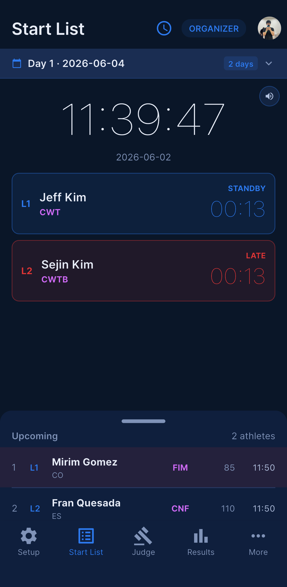

Start List 탭은 그날의 출전 순서와 다음 선수 OT까지의 실시간 카운트다운을 보여줍니다. OT가 가까워지면 앱이 카운트다운을 음성으로 출력하므로, 선수와 심판이 화면을 보지 않아도 들을 수 있습니다.

### 음성 카운트다운

OT가 가까워지면 앱이 음성 cue를 재생하여 선수와 심판이 화면을 보지 않아도 카운트를 들을 수 있습니다. cue는 **사전 녹음된 오디오 파일**이라 **iOS와 Android에서 동일하게** 들립니다 (이전 버전은 각 폰의 내장 TTS를 써서 기기마다 음성이 달랐습니다).

OT 이전 cue:
`2:00`("two minutes to official top"), `1:30`, `1:00`, `0:30`, `0:20`, `0:10`, 그 후 `5 — 4 — 3 — 2 — 1`, 그리고 OT 시점에 **"official top"**.

출발 윈도우(OT 이후) cue: +1초에 **"plus one"**, 이어서 윈도우가 끝날 때까지 경과 초가 호출되며(종목별 한계까지), 윈도우 끝까지 출발하지 않으면 **"start cancelled"**로 마무리됩니다.

### 뮤트 버튼

> 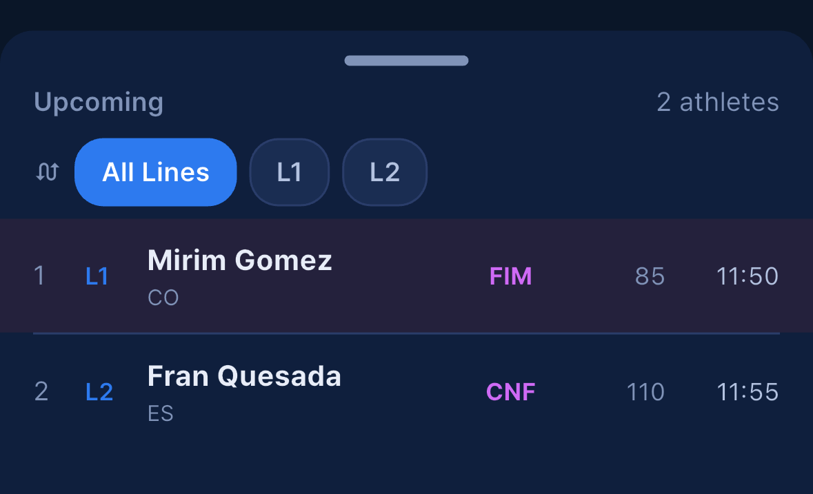

AppBar의 🔊 / 🔇 아이콘을 탭하여 음성 안내를 끄거나 켤 수 있습니다. 다음과 같은 경우 유용합니다:

- 실내 풀에서 별도 PA 시스템이 안내를 담당할 때.
- 선수들이 무음 카운트다운을 선호할 때.
- 회의에 잠시 들어가 디바이스 소리를 끄고 싶을 때.

뮤트는 토글한 디바이스에만 적용됩니다 — 같은 이벤트의 다른 디바이스는 계속 음성이 나갑니다. 화면의 시각적 카운트다운은 뮤트와 무관하게 계속 진행됩니다.

### Speaker Mode (스피커 모드)

> 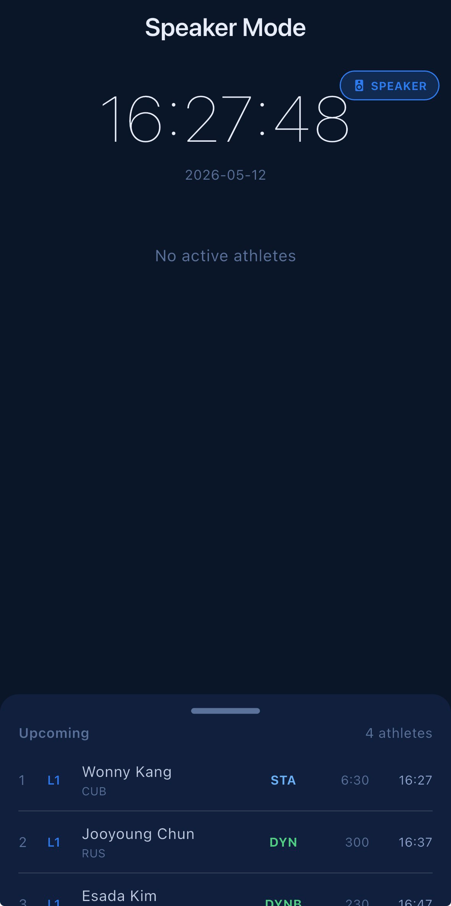

Speaker Mode는 디바이스를 **전용 카운트다운 안내기**로 만듭니다 — 행사장 메인 스피커에 연결하기 적합합니다. 활성화하면:

- 화면이 Start List 뷰에 고정되고 다른 탭은 숨겨집니다.
- 뮤트가 강제로 해제됩니다 (실수로 음소거 불가).
- 화면이 항상 켜져 있습니다 (자동 잠금 안 됨).
- PIN을 입력해야 Speaker Mode를 종료할 수 있어, 지나가는 사람이 실수로 끄지 않습니다.

**활성화**: 역할 / 프로필 메뉴 → **Speaker Mode** → 4자리 PIN 설정.

**종료**: Speaker Mode 배지 탭 → PIN 입력 → 확인.

권장 셋업: 전용 폰 또는 태블릿을 행사장 오디오 시스템에 연결하고 대회 전체 시간 동안 Speaker Mode로 유지. 음성 출력은 일반 대기보다 배터리를 빠르게 소모하므로 충전기 연결 권장.

### 모든 화면 자동 잠금 해제

앱은 **모든** 화면에서 화면이 꺼지지 않도록 합니다 (Start List에만 해당하지 않음). 카운트다운과 알림이 디바이스를 만지지 않아도 정상 동작하도록 보장합니다. 앱을 열면 즉시 적용되는 전역 설정입니다. 종일 이벤트에서는 충전기를 연결해 두세요 — 평소보다 배터리가 빠르게 줄어듭니다.

---

---

## 판정 결과 입력

> 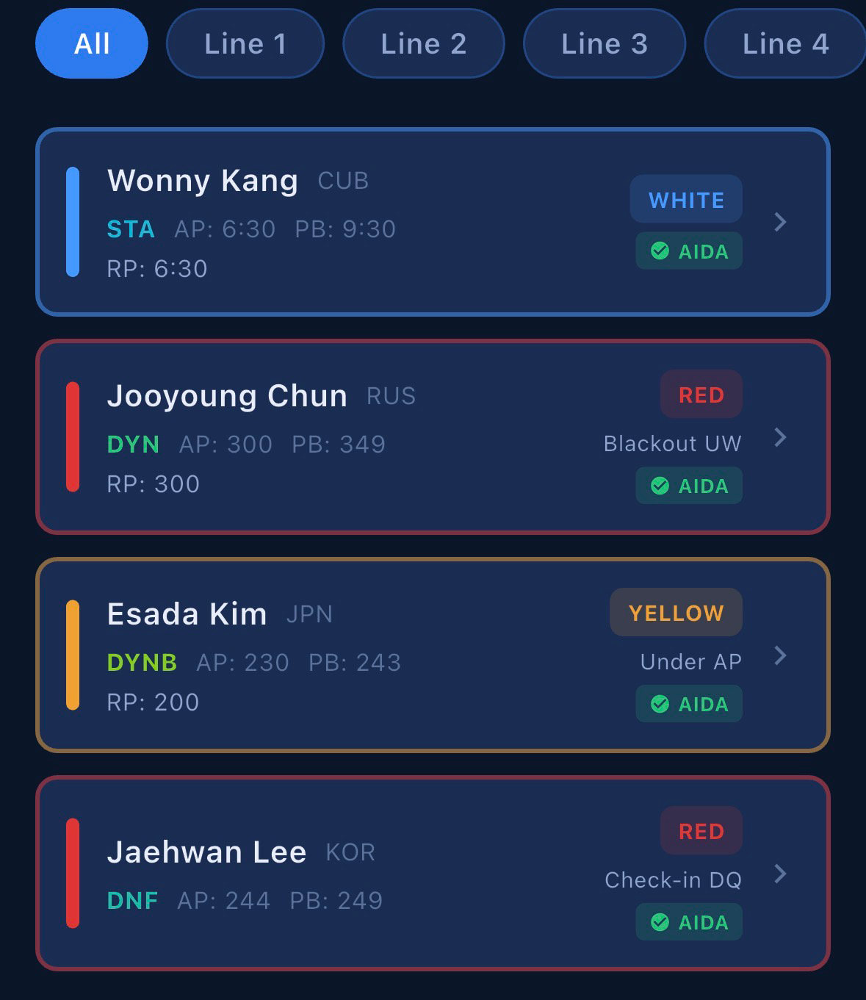

Judge 탭은 현재 일자의 모든 선수를 표시합니다. 카드를 탭해서 결과를 입력합니다.

### 결과 입력

1. **RP** — 실현 기록 (static: 시간, dynamic: 거리, depth: 깊이).
2. **카드** — White (클린), Yellow (페널티), Red (DQ).
3. **페널티 사유** — White 외 카드 선택 시 필수. [페널티](#페널티-룰북-178) 참조.
4. **Start offset** — 빠른 출발 (음수) 또는 늦은 출발 (양수) 초. 출발 윈도우 페널티 계산에 사용.
5. **REMARKS** — 특정 사유 (BO, Other Penalty, DQ Other 등)에 필수. 앱이 템플릿을 미리 채워주니 빠진 부분만 작성.
6. **Save Result** 탭.

### 카드 배지

저장 후 선수 카드에 작은 배지가 표시됩니다:

- **✅ AIDA** — AIDA International에 동기화됨.
- **🔁 Retry** — AIDA 동기화 실패. 탭하면 사유 확인 및 재시도.
- **⛔ Offline** — 이 디바이스에 로컬 저장됨. 다시 온라인되면 자동 동기화. [오프라인 동작](#오프라인-동작) 참조.

배지가 없으면 AIDA 연동이 설정되지 않은 것 (해당 선수에 startId 없음) — Mock 모드에서는 정상.

---

## 페널티 (룰북 17.8)

앱은 AIDA Rulebook 17.8 섹션을 따릅니다. 사유는 카드 색상으로 그룹화됩니다.

### 🟨 Yellow 카드 사유

- **Start** — 잘못된 시작 기술 (Pool DYN: 벽 시작 실패 등).
- **Early Start** — OT 전에 출발. 출발 윈도우 내 5초당 1점.
- **Late Start** — OT 후에 출발. 출발 윈도우 내 5초당 1점.
- **Grab** — 수행 중 라인, 벽, 또는 플랫폼을 잡음.
- **Other Penalty** — 위에 해당하지 않는 것. **REMARKS 필수**.

### 🟥 Red 카드 사유

- **Surface Protocol** — 수면 후 15초 내 surface protocol 부정확.
- **Blackout Surface** — 수면에서 운동 통제 상실 또는 의식 상실. **REMARKS 필수** (회복 시간 등).
- **Blackout UW** — 수중에서 의식 상실. **REMARKS 필수**.
- **DQ Late Start** — Late Start가 출발 윈도우 초과 (Pool +10s, Depth +30s).
- **Jump Start** *(Pool DYN만)* — OT 전에 벽을 떠남.
- **DQ Other** — 기타 사유로 실격. **REMARKS 필수**.

### 출발 윈도우

| 종목 | 윈도우 | 윈도우 내 | 윈도우 초과 |
|------|--------|-----------|-------------|
| Pool | ±10 s | 5초당 1점 (Yellow Early/Late Start) | 늦은 쪽: DQ Late Start (Red); Pool DYN의 빠른 벽 출발: Jump Start (Red) |
| Depth | ±30 s | 5초당 1점 (Yellow Early/Late Start) | 늦은 쪽: DQ Late Start (Red) |

### REMARKS

AIDA Rulebook 4.1.16.2은 모든 Yellow와 Red에 서면 사유를 요구합니다. 사유에 REMARKS가 필수인데 비어있으면 Save 버튼이 동작을 차단합니다.

사유 선택 시 REMARKS 필드에 템플릿이 미리 채워집니다 (예: `BO Surface, recovery: ___`). 빠진 부분을 채운 후 저장 — 이것이 공식 기록입니다.

### 다중 선택 및 카드 결합

> 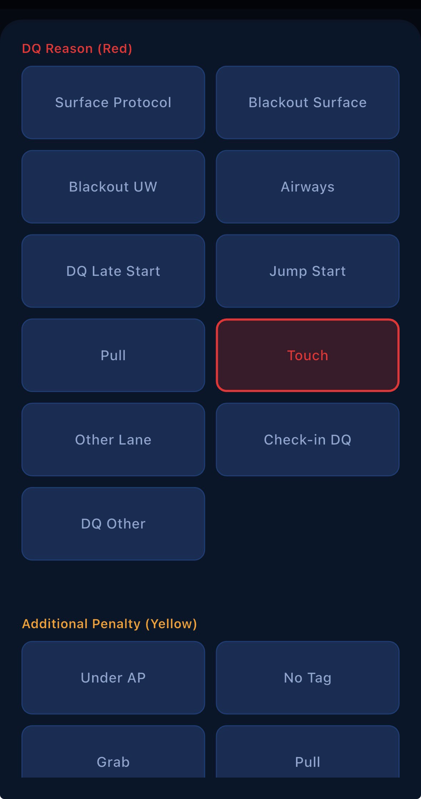

Red 카드를 탭하면 사유 시트에 **Red와 Yellow 사유가 두 그룹**으로 동시에 표시됩니다:

- **DQ Reason (Red)** — Surface Protocol, Blackout Surface, Blackout UW, Airways, DQ Late Start, Jump Start, Pull, Touch, Other Lane, Check-in DQ, DQ Other
- **Additional Penalty (Yellow)** — Under AP, No Tag, Grab, Pull, Turn, Start, Early Start, Late Start, Lanyard, Other Penalty

두 그룹에서 여러 사유를 동시에 선택해 한 번에 저장할 수 있습니다 — 예를 들어 Red **Airways** + Yellow **Under AP**. 선택된 칩은 카테고리별로 색상이 구분되어 있어 무엇이 기록되는지 한눈에 확인됩니다.

Yellow 카드 단독도 다중 선택을 지원합니다 (예: Early Start + Grab). Yellow 카드에서는 Red 그룹이 표시되지 않습니다.

---

## 이의제기 (Protest)

이의제기(protest)는 AIDA 룰북 17.8에 따라 결과에 정식으로 이의를 제기하는 절차입니다. Apnea Comp는 제출 → 선수 서명 → jury 결정 → 결과 수정까지 전 과정을 추적합니다.

**모든 이의제기는 선수 서명으로 마무리됩니다** — 스태프가 선수를 대신해 시작하더라도 마찬가지입니다.

### 제출 권한

Organizer, Main Judge, Judge, 또는 선수 본인. 수수료(fee)는 앱에서 추적하지 않습니다.

### 선수가 직접 제출

> 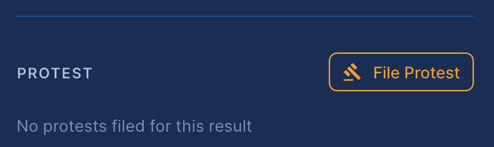

1. 선수 모드 → **My Info** → 결과 옆 **File Protest** 탭.
2. 사유를 입력하고 화면에 서명한 뒤 제출.

> 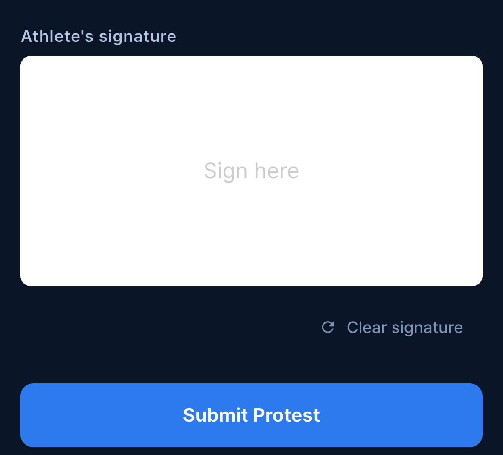

상태가 **Pending**(jury 대기)이 됩니다.

### 스태프 대리 제출

1. **Judge** 탭 → 선수 카드 탭 → **File Protest (on behalf)**.
2. 사유를 입력하고 제출. 아직 서명 없음.
3. 이의제기가 선수에게 **Awaiting signature** 상태로 전달됩니다. 선수가 본인 폰에서 **My Info**를 열어 확인하고 서명하면 그때 **Pending**이 됩니다.

### Jury 결정

> 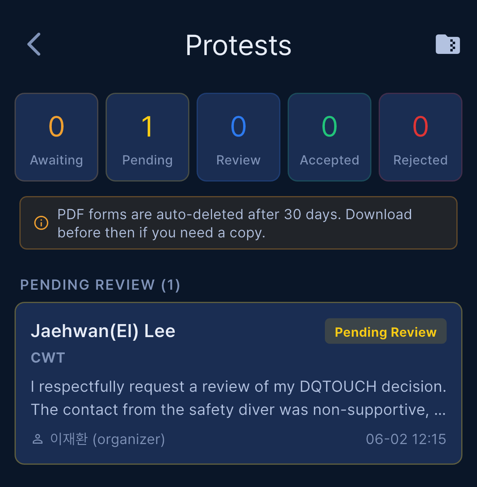

**More → Protests**(Organizer / Main Judge / Judge)를 엽니다. 목록은 상태별로 그룹화됩니다(Awaiting signature / Pending / Reviewing / Accepted / Rejected / Withdrawn). 항목을 탭해 결정합니다.

> 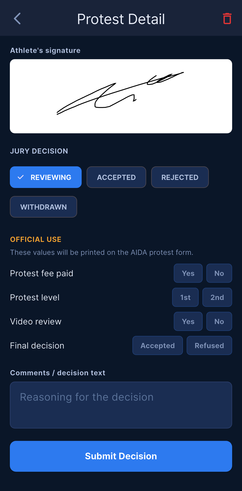

- **Accept** — 결과(card, RP, remarks)를 수정할 수 있습니다. 선수 기록이 자동 갱신되고, 변경이 Results·Rewards·AIDA에 반영됩니다.
- **Reject** / **Withdraw** — 결과 유지.

**Awaiting signature** 상태에서는 결정할 수 없습니다 — 선수가 먼저 서명해야 합니다.

### 이의제기 삭제

Organizer 또는 Main Judge는 상세 화면(🗑 휴지통 아이콘)에서 어떤 이의제기든 삭제할 수 있습니다 — 테스트 항목이나, 오지 않을 서명을 기다리며 막힌 레거시 이의제기를 정리할 때 사용하세요.

### 알림

이의제기가 **제출**·**서명 대기**·**결정**될 때 모든 스태프와 해당 선수에게 푸시 알림이 각자의 앱 언어로 전송됩니다.

---

## 재경기 & Opener

### 재경기 (Re-swim)

이의제기가 받아들여지거나(또는 심판이 재시기를 명할 때) 선수는 다시 경기합니다. AIDA에서 해당 day의 시작 명단을 로드하면 그 day의 선수가 교체되므로, 재경기는 먼저 **큐에 예약**한 뒤 목표 day의 명단이 생성될 때 삽입됩니다 — 그래야 재로드로 사라지지 않습니다.

> 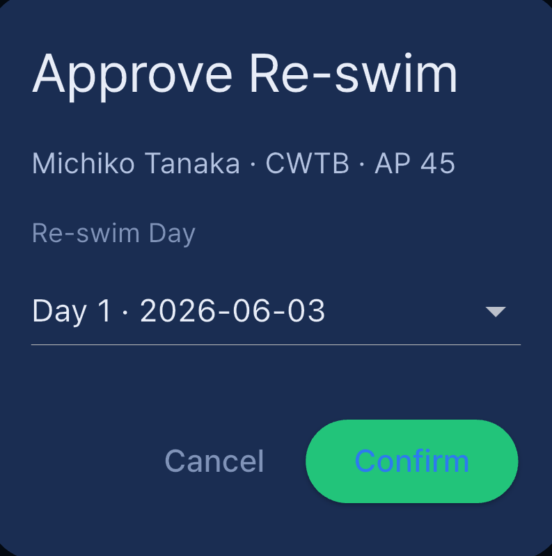

1. **예약** — Judge / Main Judge / Organizer. 이의제기 결정 시 재경기를 승인하거나, 원하는 day에 예약(날짜 드롭다운에서 선택)합니다.
2. **배치** — 그 day의 시작 명단이 생성/로드될 때 앱이 *"재경기 N명 배치"* 안내를 띄웁니다. 자동 정렬(AP 오름차순 / 내림차순 / 랜덤)을 선택하거나 **Assign Lines**로 각 선수를 수동 배치(선수 탭 → 목표 Line·위치 탭)합니다. 이미 로드된 day의 재경기면 즉시 배치할 수 있고, 그렇지 않으면 Setup → Add Athlete 아래 **"대기 중 재경기 배치"** 안전 버튼이 있습니다.

> 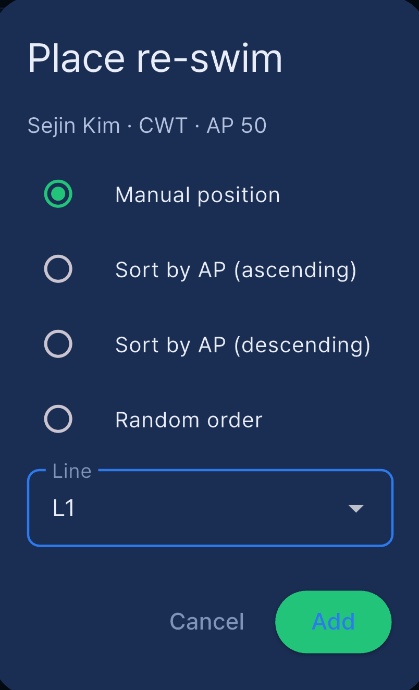

3. **원본 제외** — 원본 엔트리는 **invalidated**로 표시됩니다: 순위(Rewards)에서 제외되지만 Results에는 계속 표시됩니다. 재경기 결과가 그 day의 순위에 반영되고, 원본 start ID로 AIDA에 전송됩니다.

### Opener

**Opener**는 순위에 포함되지 않아야 하는 워밍업/시연 엔트리입니다. Organizer / Main Judge가 **Setup → Add Athlete**에서 추가합니다: 이름, 국적, 성별, 종목, AP, PB (STA는 mm:ss 시계 입력, 그 외는 숫자). Opener는 **순위에서 제외되며 AIDA로 전송되지 않습니다**.

> 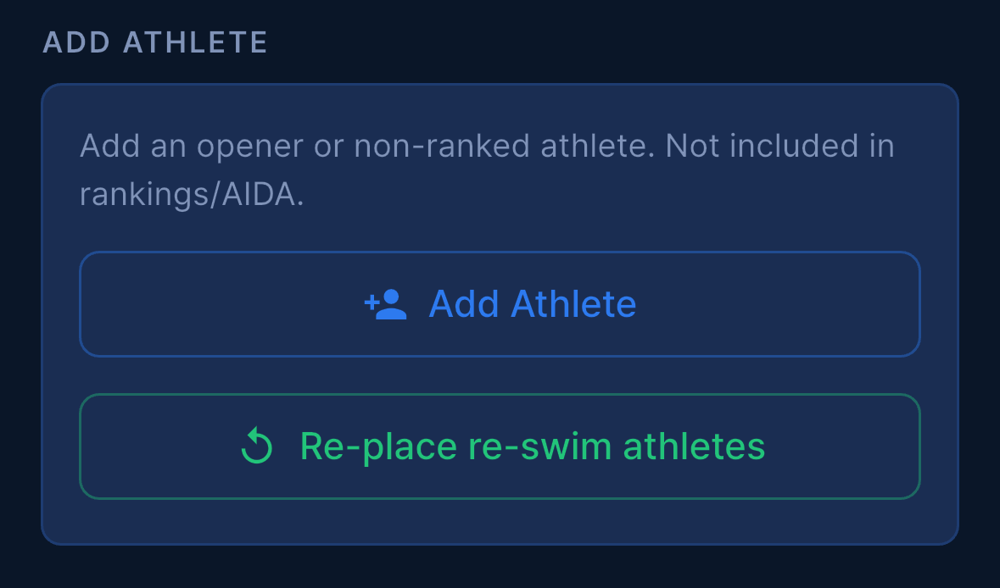

---

## 일정 조정 (OT Delay)

대회가 지연될 때 (워밍업 길어짐, 사고, 장비 문제 등) 시작 명단을 다시 만들지 않고 남은 OT를 밀 수 있습니다.

### 위치

**Start List** 또는 **Judge** 탭의 AppBar 우측, 역할 배지 직전에 🕒 아이콘이 있습니다. **Organizer와 Main Judge에게만 표시됩니다.**

> 

### 사용법

1. 🕒 탭 → **Adjust Schedule** 다이얼로그가 열림.
2. 지연 시작점 선수 선택 (이 선수부터 OT가 밀림).
3. 지연 시간을 **분** 단위로 입력 (정수, 양수만).
4. 미리보기에서 영향받는 각 선수의 시간 변화 확인 (이전 → 이후).
5. **Apply** 탭.

선택한 선수부터 모든 OT가 그 시간만큼 뒤로 밀립니다. 해당 체크인/워밍업 시각도 함께 밀립니다.

### 부수 효과

- **푸시 알림** — OT가 변경된 모든 선수에게 자동 푸시: *"Your OT has been delayed by N minute(s)"*. 별도 구독이 필요 없으며, 영향받은 선수에게만 발송.
- **활동 로그** — Log 화면에 기록.

### 주의

- 양수 지연만 지원. 더 빠르게 당기는 것은 불가.
- Undo는 **아직 지원되지 않음** — Apply 전에 미리보기를 신중히 확인.
- 모든 스태프 디바이스가 실시간으로 업데이트됨.

---

## 푸시 알림

Apnea Comp는 시간 민감한 이벤트 업데이트에 푸시 알림을 사용합니다. 알림은 OneSignal을 통해 전달되며, OneSignal이 다시 APNs(iOS)와 Firebase Cloud Messaging(FCM, Android)으로 전달합니다. 각 알림은 수신자가 선택한 앱 언어로 발송됩니다.

### 알림 종류

수동으로 발송하는 알림과 시스템이 이벤트 상태에 따라 자동 발송하는 알림 두 가지가 있습니다.

#### 수동 (Organizer / Main Judge만)

More 메뉴에서 **Send Push**를 열면 작은 패널에 세 버튼이 있습니다. 각각 선택한 일자의 모든 등록 선수에게 발송:

- **Publish Start List** — 그날의 라인과 OT가 확정될 때.
- **Unofficial Results** — 선수 검토용 초기 결과 발행.
- **Official Results** — protest 윈도우 후의 최종 결과.

각 탭마다 발송 전 수신자 수가 표시되는 확인 다이얼로그가 뜸.

#### 자동

스태프 작업 없이 실행됩니다:

| 트리거 | 수신자 | 시점 |
|--------|--------|------|
| OT Delay 적용 | 영향받은 선수만 | Organizer / Main Judge가 지연을 적용한 즉시 |
| 체크인 마감 임박 (1시간) | 미체크인 선수 | OT 2시간 전 (= 체크인 마감 1시간 전) |
| 체크인 마감 임박 (30분) | 미체크인 선수 | OT 1.5시간 전 (= 체크인 마감 30분 전) |
| 이의제기 제출 | 모든 이벤트 스태프 + 해당 선수 | 이의제기가 제출될 때 |
| 이의제기 서명 대기 | 모든 이벤트 스태프 + 해당 선수 | 스태프가 선수를 대신해 제출할 때 |
| 이의제기 결정 | 모든 이벤트 스태프 + 해당 선수 | jury가 accept / reject / withdraw 할 때 |

선수가 체크인되거나 DNS / Late로 표시되면 알림 발송이 중단됩니다.

### 알림을 받는 사용자

다음을 모두 만족하는 사용자만:

- 연결된 선수 계정 (위의 Path A 또는 Path B)
- OS 수준에서 알림 허용
- 앱 내 알림 활성화 (기본값: on)
- 활성 푸시 토큰 (앱을 한 번 이상 실행하면 생성됨)

### 알림 비활성화

- iPhone: 설정 → Apnea Comp → 알림 → 끄기.
- Android: 설정 → 앱 → Apnea Comp → 알림 → 끄기.
- 앱 내: More → About → 알림 토글.

비활성화하면 푸시 토큰이 즉시 서버에서 삭제됩니다.

---

## 오프라인 동작

앱은 풀/암반 환경에서 흔히 발생하는 인터넷 끊김 상황에서도 계속 동작하도록 설계되었습니다.

### 연결 끊김 시 동작

상단에 **"You are offline"** 빨간 바가 나타납니다. 다음은 가능:

- ✅ Judge 결과 저장 (로컬 저장, 나중에 동기화)
- ✅ 선수 체크인 (로컬 저장, 나중에 동기화)
- ❌ AIDA에서 새 선수 명단 로드
- ❌ 푸시 알림 수신 (재연결 후 전달, FCM이 큐에 보관)

### Offline 배지

> 

오프라인에서 결과를 저장하면 선수 카드에 AIDA 동기화 배지 대신 작은 **⛔ Offline** 배지가 표시됩니다. 의미:

- 결과는 디바이스 메모리에 **안전**하게 보관.
- **아직** 서버에 도달하지 않음.
- 앱이 백그라운드에서 5초마다 자동 재시도.

인터넷이 복구되면 배지가 자동으로 **✅ AIDA**로 변경. 수동 작업 불필요.

### 수동 동기화

자동 재시도가 따라잡지 못한 경우 **Results** 열기:

> 

대기 중인 항목이 있으면 주황색 배너가 표시됨:

- **"N개의 오프라인 결과가 동기화 대기 중"**과 **Sync now** 버튼 — 즉시 재시도.
- **"M개의 결과가 AIDA에 동기화되지 않음"**과 **Resync** 버튼 — AIDA 측 실패 (토큰, 서버 오류 등).

### ⚠️ 중요

오프라인 결과는 동기화될 때까지 디바이스 메모리에 있습니다. **오프라인 항목이 대기 중일 때 앱을 강제 종료하거나 폰을 재부팅하지 마세요** — 손실됩니다. ⛔ 배지가 모두 사라질 때까지 기다리거나, 종료 전 Sync now를 탭하세요.

확실하지 않으면 Results를 열고 주황 배너를 확인. 배너 없음 = 대기 항목 없음.

---

## AIDA 연동

### 토큰 발급

<https://www.aidainternational.org>의 AIDA International 관리자 계정으로 로그인. 등록한 대회를 열고 API / Integration 섹션에서 다음을 복사:

- **AIDA Token** — 긴 영문/숫자 문자열.
- **AIDA Event ID** — 보통 4~6자리 숫자.

이 옵션이 보이지 않으면 이벤트를 등록한 AIDA 관리자가 공유해야 하거나, 본인 계정 권한 업데이트가 필요합니다.

### 앱에 설정

Edit Event → 두 값 입력 → Test Connection → Save. 앱은 토큰을 서버에 안전하게 캐시합니다 (URL에 노출되지 않음). 토큰 업데이트 시 다음 저장부터 즉시 새 값 사용 (앱 재시작 불필요).

### 동기화되는 데이터와 시점

- **읽기** — Setup → Load Athletes로 시작 명단 (이름, AP, PB, 종목) 가져옴.
- **쓰기** — Judge에서 Save할 때마다 결과 (RP, 카드, 사유, remarks, start offset)를 전송. 백그라운드, 비차단.

### 동기화 실패 시

- **토큰 만료/무효** → 빨간 SnackBar: *"AIDA token invalid — update in Edit Event"* (Organizer / Main Judge) 또는 *"ask Organizer to update"* (다른 역할). 토큰 업데이트 후 Results → Resync.
- **네트워크 오류** → 카드에 🔁 Retry 배지. 탭하면 오류 메시지 확인 및 재시도, 또는 Results → Resync로 일괄 처리.
- **오프라인** → ⛔ Offline 배지. 온라인 시 자동 재시도. [오프라인 동작](#오프라인-동작) 참조.

### Mock 모드

토큰을 `test` 또는 `demo`로 설정하거나 두 필드를 비워두면 AIDA 없이 동작. 앱이 샘플 선수를 생성하고 아무것도 전송하지 않음. 트레이닝, 드라이런, 데모용. Mock 모드 이벤트는 실제 날짜를 무시하므로 카운트다운과 음성 안내가 즉시 동작 — 테스트에 적합합니다.

---

## 멀티데이 이벤트

여러 날에 걸친 대회의 경우:

- Setup → **Total Days** → 대회 일수 설정.
- 각 일자는 자체 시작 명단, 체크인, 결과, OT를 가짐.
- 일자가 둘 이상이면 AppBar 아래에 **Day selector** 표시. 탭해서 전환.
- **Rest day**: Setup에서 표시. 일정 생성에서 건너뜀.

데이터는 일자 간에 **이월되지 않음** — Day 2에서 선수 이동해도 Day 1에 영향 없음. 일자별 합산 점수는 Results에서 계산.

이벤트가 AIDA에 멀티데이로 등록되어 있으면 Load Athletes가 일자별 시작 명단을 자동으로 가져옵니다.

---

## 결과 및 내보내기

**Results** 탭은 판정이 들어올 때마다 라이브 순위를 업데이트합니다.

- 상단 **요약 카드**: 전체 선수, white / yellow / red, AP / PB / RP.
- **종목 필터**로 좁히기.
- **동기화 배너** (있을 시): Offline 대기, AIDA 대기, 토큰 문제.
- **선수 목록** 점수 정렬, 탭하면 상세.
- **Export** — 게시판 게시 또는 선수 발송용 CSV 공유.

### Rewards & 순위

**Rewards** 탭(선수 모드에도 있음)은 선수를 포인트로 정렬하며 종목·성별로 그룹화합니다.

- **Day 칩** — Total, Day 1, Day 2 … 로 순위 범위 지정.
- **Include yellow card scores** 토글.
- **Tiebreak**(우상단 ⚙) — 드래그로 동점자 처리 규칙 순서 변경. AIDA 기본값(룰북 §4.2.16): 총점 → **AP−RP 차이 최소** → Red 적은 순 → Yellow 적은 순 → White 많은 순. 완전 동률은 같은 순위를 공유하고 다음 순위는 건너뜁니다(**올림픽 플레이싱**, 예: 공동 1위 → 다음은 3위). 깊이 RP는 정수 미터로 입력합니다(§4.1.22.1).
- Opener와 invalidated(재경기된) 엔트리는 순위에서 제외됩니다. Results에는 모두 표시됩니다.
- **Export CSV** — ↓ 아이콘으로 UTF-8 CSV 공유(모든 언어에서 Excel / Numbers로 정상 열림). 현재 Day / Yellow / Tiebreak 설정이 반영됩니다.

---

### Records (WR/CR/NR) — 기록

세계 / 대륙 / 국가 기록 시도를 표시하고 확정합니다.

1. **대회 표시** — 이벤트 생성/수정 시 **Record Attempts**에서 **World Record** / **Continental**을 켭니다. 그러면 이벤트 카드와 Results 상단에 🏅 뱃지가 표시됩니다.
2. **기록 확인** — **Results** 탭에서 **Check WR/CR/NR** 탭. 화이트카드 선수마다 AIDA 공식 기록(국가·종목·성별)을 조회해 WR / CR / NR을 제안합니다. 네트워크 필요 — 조회 실패는 건너뜁니다.
3. **확정** *(Organizer / Main Judge)* — 제안은 점선 뱃지(예: "WR?")로 표시됩니다. 탭해서 등급을 확정하거나 해제합니다. 확정된 기록은 실선 뱃지로 표시되고 CSV 내보내기에 포함됩니다.

> 화이트카드(유효) 결과만 대상입니다. 페널티가 있는 결과는 세계/대륙 기록이 될 수 없습니다(룰북 §10.2). 제안은 실현기록(RP)을 현재 기록과 비교한 것이며, 최종 판단은 심판이 합니다.

## 화면 & 언어

두 설정 모두 아바타 메뉴(우측 상단)에 있으며, 앱 전체에 즉시 적용됩니다.

### 테마

> 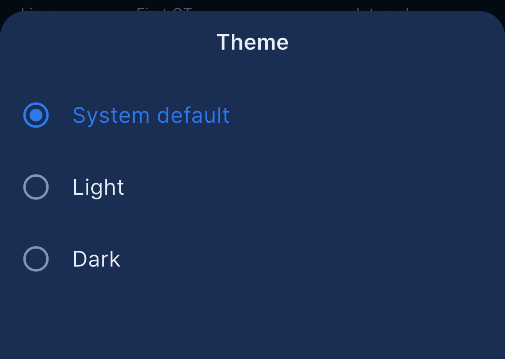

아바타 탭 → **Theme** → **System default**, **Light**, **Dark** 중 선택.

### 언어

> 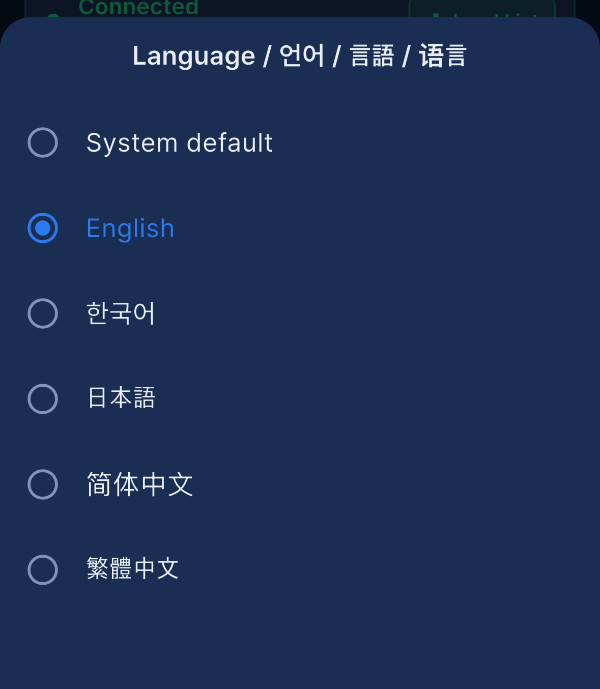

아바타 탭 → **Language** → **System default**, **English**, **한국어**, **日本語**, **简体中文**, **繁體中文** 중 선택. 즉시 전환되고 선택이 저장됩니다.

대회 표준 용어는 모든 언어에서 영어로 유지됩니다 — OT, AP, RP, PB, 종목 코드(STA, DYN, …), WHITE / YELLOW / RED, 역할명, Line — 그래서 여러 나라의 스태프가 같은 라벨을 읽습니다.

---

## FAQ

### 스태프 폰의 배터리가 떨어지면 입력한 결과를 잃나요?

아니요. 결과를 저장하는 즉시 서버 (오프라인이면 디바이스)에 저장됩니다. 같은 이벤트의 다른 디바이스가 결과를 즉시 봅니다. 폰이 영구히 분실되어도 동기화되지 않은 오프라인 결과만 위험에 노출됩니다 — 그 시점에 대기 중인 것이 있을 때만.

### 두 사람이 같은 선수의 다른 결과를 저장하면?

마지막 저장이 적용됩니다. 앱은 현재 동시 편집 경고를 제공하지 않습니다. 보통 한 명의 심판이 결과를 입력하므로 구두로 조율하세요.

### 선수에 AP / PB는 표시되는데 startId는 없는데요?

Mock 모드에서 추가됐거나 AIDA 외부에서 수동 가져온 선수일 가능성. AIDA 동기화에는 startId가 필요 — 이 선수들의 결과는 AIDA로 전송되지 않음 (배지 없음). Results에는 정상 표시됩니다.

### AIDA 토큰을 변경했는데 이전 결과가 계속 실패합니다

Results 열기 → 배너에 "Update token & resync"가 보이면 탭. 새 토큰으로 대기 항목들이 재전송됩니다. 앱이 자격 증명을 서버에 캐시하고 Edit Event 저장 시 캐시를 갱신하므로 재시작 불필요.

### 체크인 중 인터넷이 끊기면?

체크인이 로컬에 저장되고 선수 카드에 작은 ⛔ "Offline" 배지가 표시됩니다. 연결 복구 즉시 (5초 안) 서버와 자동 동기화. 선수가 다시 서명할 필요 없음. 서명 그림 자체는 저장되지 않으며 그 순간 시각 확인용으로만 사용됩니다.

### 선수가 푸시 알림을 받지 못합니다

흔한 원인:

- 가입은 했지만 AIDA 선수 레코드와 연결되지 않음 (자동 매칭 실패, 초대 코드 미사용). 연결 없이는 시스템이 어떤 선수인지 알 수 없음.
- OS 수준에서 알림이 비활성화. iPhone: 설정 → Apnea Comp → 알림. Android: 설정 → 앱 → Apnea Comp → 알림.
- 새 디바이스에서 앱이 한 번도 실행되지 않음 — 푸시 토큰은 실행 시 발급됨.
- 선수가 DNS / Late / 이미 체크인됨 (이 경우 체크인 알림은 의도적으로 중단).

### 이벤트를 삭제할 수 있나요?

네. Organizer 또는 Main Judge가 이벤트를 삭제할 수 있습니다 — 이벤트 목록에서 스와이프하거나 **Edit Event → Delete**. 삭제는 영구적이며 해당 이벤트의 모든 데이터(선수, 결과, 로그, 체크인 상태, 이의제기)를 제거합니다. 파일 스토리지에 생성된 이의제기 PDF는 이벤트 전체 삭제 시 자동 제거되지 않으니, 완전 삭제가 필요하면 연락 주세요.

### 이의제기가 "Awaiting signature"에서 막혀 선수가 서명할 수 없어요

현재 서명 흐름 이전에 만들어진 오래된 이의제기에서 발생합니다. Organizer 또는 Main Judge가 **More → Protests → 해당 이의제기 → 🗑**에서 삭제할 수 있습니다. [이의제기 → 이의제기 삭제](#이의제기-protest) 참조.

### "업데이트 필요" 화면이 떠서 들어갈 수 없어요

설치된 버전이 운영자가 정한 실사용 최소 버전보다 낮습니다. App Store / Play Store에서 최신 버전으로 업데이트한 뒤 다시 열면 — 앱이 재확인하고 통과시킵니다.

### 대회 중 앱을 계속 열어두어야 하나요?

네, 판정/체크인 작업 디바이스에서는. 앱은 백그라운드에서 동작하지 않습니다. 다른 앱으로 전환해도 화면 상태는 보존되지만, 오프라인 자동 재시도는 앱을 다시 열 때까지 멈춥니다.

**앱은 모든 화면에서 자동 잠금을 막아주므로**, 디바이스를 테이블에 두어도 화면이 꺼지지 않습니다. 이 때문에 배터리는 평소보다 빠르게 소모되니, 종일 이벤트에서는 충전기를 연결해 두세요.

푸시 알림 자체는 앱이 열려있지 않아도 됩니다 — 알림을 허용한 한, iOS / Android는 앱이 닫힌 상태에서도 전달합니다.

### 어떤 디바이스를 지원하나요?

iPhone (iOS 15+) 및 Android (Android 9+). 태블릿도 동작하지만 레이아웃은 폰 기준 최적화.

---

## 트러블슈팅

### Judge에서 "Could not save" 빨간 SnackBar

앱이 결과를 로컬에도 저장하지 못했다는 뜻 — 보통 선수는 로드되었지만 로컬 목록이 동기화 어긋났을 때 발생. **Reload** 탭 (Setup) 후 재시도. 진단을 위해 오류 메시지에 athlete ID와 현재 카운트가 포함됨.

### "AIDA token invalid"가 계속 뜸

- Edit Event에서 토큰에 앞뒤 공백이 없는지 확인.
- Test Connection 탭 — 성공하나?
- Test 실패 시: AIDA 관리자에게 새 토큰 발급 요청.
- Test 성공인데 저장만 실패: Results → Resync.

### 분명히 온라인인데 "You are offline"이 뜸

연결성 체크는 서버에 핑을 보냅니다. 서버가 잠시 도달 불가 (드물거나) 네트워크가 Supabase URL을 차단 (호텔/공공 wifi에서 흔치 않음)하면 표시기가 빨강으로 남을 수 있음. 어쨌든 결과를 저장해보세요 — 성공하면 표시기가 몇 초 안에 사라집니다.

### OT Delay 아이콘이 안 보임

확인:

- **Start List** 또는 **Judge** 탭에 있는지 (다른 탭에서는 숨겨짐).
- 역할이 Organizer 또는 Main Judge인지 (다른 역할은 안 보임).
- AppBar 우측, 역할 배지 직전.

### Line Assignment 후 일정이 이상함

OT 계산은 저장 시 실행됩니다. 선수 순서를 바꿨는데 OT가 잘못 보이면 위로 스크롤해서 **Save**를 다시 탭 — 시간이 순서와 일치해야 합니다. 그래도 이상하면 스크린샷과 함께 연락 주세요.

### 팀원이 Pending에서 막힘

Users 탭 → 이름 찾기 → 역할 부여 (Judge / Staff 등). 이벤트별로 승인 필요 — 승인은 이벤트 간에 이월되지 않습니다.

### 판정한 선수가 있는데 Results 화면이 비어있음

당겨서 새로고침. 그래도 비면 다른 탭으로 이동했다 다시 옴. 문제가 지속되면 스크린샷과 함께 연락 — 이런 일은 발생하면 안 됩니다.

### 폰을 바꾼 후 푸시 알림이 안 옴

새 폰에 로그인하고 앱을 한 번 실행. 새 디바이스의 푸시 토큰이 계정의 이전 토큰을 대체. 이전 폰은 더 이상 알림을 받지 않습니다.

---

## 개인정보 및 데이터

앱이 수집하는 데이터, 처리 방식, 사용자 권리에 대한 자세한 내용은 [개인정보처리방침](https://elfreediving.github.io/aida-competition-privacy/ko/PRIVACY_POLICY)을 참조하세요.

요약:

- **저장하는 것** — 계정 이메일, 표시 이름, 프로필 사진 (업로드한 경우), AIDA 선수 UUID (선수로 가입한 경우), 푸시 알림 구독 ID (알림 활성화한 경우), 입력한 대회 데이터 (선수 결과, 체크인 상태, 활동 로그, 이의제기).
- **이의제기 서명** — 이의제기 제출 시 선수(및 jury)의 손으로 그린 서명은 공식 이의제기 기록의 일부로 **저장**되며 생성된 PDF에 포함됩니다. 아래 규칙의 유일한 예외입니다.
- **저장하지 않는 것** — 선수의 연락처, 사진, 생년월일, **체크인** 서명 그림(체크인 패드는 시각 확인용일 뿐), AIDA가 공개적으로 노출하는 것 외의 개인 식별자.
- **위치** — Supabase (현재 미국 리전), 저장 시 암호화. Row-Level Security 정책으로만 접근. 데이터는 이벤트별로 격리. 푸시 알림은 OneSignal을 거쳐 APNs (iOS) 및 FCM (Android)으로 전달.
- **AIDA 토큰** — 암호화, Organizer / Main Judge 역할만 접근. URL이나 클라이언트 메모리에 필요 이상 노출되지 않음.
- **오프라인 버퍼링** — 오프라인에서 저장한 판정 결과는 앱 메모리에만 보관. 재연결 후 수 초 안에 동기화.
- **기기 로컬 저장소** — **Remember email**은 이메일을 일반 로컬 저장소(SharedPreferences / NSUserDefaults)에 저장합니다. **Remember password**를 켜면 비밀번호가 기기의 보안 키 저장소(iOS Keychain / Android EncryptedSharedPreferences)에 저장되며 서버에는 저장되지 않습니다. 테마·언어 선택도 로컬에 저장됩니다. 로그아웃하거나 앱을 삭제하면 저장된 자격 정보가 삭제됩니다.

---

## 연락처

버그, 질문, 피드백:

- 이메일: lee33179@gmail.com

문제 보고 시 다음을 포함:

- 디바이스 모델 및 OS 버전
- 앱 버전 (More → About)
- 관련 스크린샷
- 문제 발생 대략적 시각 (로그 매칭용)

---

최종 업데이트: 2026-06-02.
